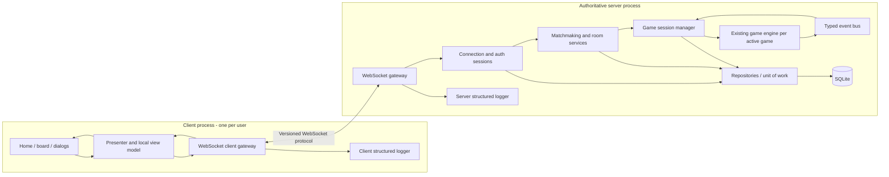

# KFChess Client-Server Transition - Master Implementation Plan

> **Superseding update (2026-07-21):** See `ARCHITECTURE_UPDATE_2026-07-21.md`. It resolves the gameplay-command gate, requires in-window OpenCV authentication for production, makes CLI authentication an optional disabled-by-default development fallback, and requires Windows/Linux/macOS portability. Older conflicting statements in this plan are obsolete.

## 1. Document Purpose

This document defines the linear implementation roadmap for evolving KFChess from a local, single-process application into a decoupled client-server system with WebSocket communication, authenticated users, persistent ratings, rating-based matchmaking, private rooms, spectators, disconnect handling, and structured observability.

The plan is based on:

- the seven-page `CTD 26 - KungFu Chess Server - The Server` specification;
- the requirements supplied with the planning request; and
- a read-only review of the current repository structure and architectural seams.

This is an implementation plan, not a claim that undecided product behavior has already been settled. Items requiring product or technical-owner confirmation are collected in [Section 15](#15-clarifying-questions-and-decision-gates). Until those decisions are answered, affected tasks should use interfaces and test doubles rather than irreversible implementation choices.

## 2. Source Requirements Traceability

| Source directive | Planned delivery location |
| --- | --- |
| Implement a publish/subscribe bus | Phase 1 |
| Use the bus for score updates, move logs, sound, and game start/end animations | Phase 1 |
| Run a simple local server with WebSocket communication | Phase 2 |
| Send commands such as `WQe2e5`; receive game state | Phase 2 |
| Support two clients; first player is White and second is Black | Phase 2 / Phase 3A |
| Demonstration login with username in a shell rather than the GUI | Phase 3A |
| Username/password login persisted in server-side SQLite | Phase 3B |
| New players start at rating 1200 and ratings change using Elo | Phase 4 |
| `Play` searches for another player within inclusive +/-100 rating | Phase 4 |
| Matchmaking waits up to one minute, then displays a failure message | Phase 4 |
| A disconnected player automatically forfeits after 20 seconds | Phase 6 |
| The client visibly counts down the disconnect grace period | Phase 6 |
| `Room` opens a dialog with room ID input and Create / Join / Cancel actions | Phase 5 |
| The second room participant is Black; later participants are viewers | Phase 5 |
| Client and server store logs for client/server activity | Phase 6, with foundations in Phase 0 |

## 3. Current-State Assessment

The current project is a Python 3.11 application with an OpenCV graphical client and a text-command runner. The primary implementation is under `kongfu_chess/`; `vpl_submit/` is a generated submission copy and must not become a second source of truth.

Useful existing boundaries that should be retained and strengthened:

- `Game` is the application facade for game operations.
- `GameEngine` coordinates rules, timing, movement, captures, and state changes.
- `GameSnapshot` provides an immutable read model suitable for transport.
- `SynchronousEventBus` and immutable domain events already establish the Observer pattern.
- `GameView` renders snapshots without needing to mutate engine internals.
- engine collaborators already use injected policies and structural protocols.
- configuration values are partly centralized in `kongfu_chess/config.py` and immutable engine settings.

Gaps relative to the target state:

- the graphical event loop constructs and invokes `Game` in the same process;
- there is no network protocol, connection/session lifecycle, or WebSocket transport;
- the event bus is minimal and currently focused on engine-domain events;
- no server application, game-session registry, or player assignment service exists;
- no authentication, password hashing, SQLite repository, or migrations exist;
- no matchmaking queue, Elo service, room registry, or spectator authorization exists;
- no reconnect grace-period state machine or server-authoritative forfeit timer exists;
- no shared structured-logging policy or end-to-end correlation IDs exist;
- `Game.state` and compatibility-style internal properties need review against strict encapsulation before the server boundary is exposed.

## 4. Target Architecture

The server must be authoritative. Clients may request actions, but they must never decide whether a move is legal, assign a color, finalize a result, update a rating, or determine that a disconnect caused a forfeit.



### 4.1 Mandatory dependency direction

1. Domain model and rules know nothing about OpenCV, WebSockets, SQLite, JSON, or logging frameworks.
2. Application services coordinate domain operations through ports/interfaces.
3. Infrastructure adapters implement WebSocket, SQLite, clocks, identifiers, password hashing, and file logging.
4. The client knows protocol DTOs and client view models, but does not import or mutate server game objects.
5. Shared protocol definitions contain serializable contracts only; they do not become a dumping ground for server or UI logic.

### 4.2 Proposed package ownership

The exact names may be adjusted during Phase 0, but each responsibility must have one owner.

```text
kongfu_chess/
|-- domain/ or existing engine, model, realtime, rules
|-- application/
|   |-- game_sessions/
|   |-- authentication/
|   |-- matchmaking/
|   `-- rooms/
|-- protocol/
|   |-- envelopes.py
|   |-- commands.py
|   |-- events.py
|   `-- serialization.py
|-- server/
|   |-- websocket_gateway.py
|   |-- connection_registry.py
|   |-- composition_root.py
|   `-- main.py
|-- client/
|   |-- websocket_gateway.py
|   |-- presenter.py
|   |-- connection_state.py
|   `-- main.py
|-- persistence/
|   |-- sqlite_connection.py
|   |-- migrations/
|   `-- repositories/
|-- observability/
|   `-- logging.py
`-- configuration/
    |-- models.py
    `-- loader.py
```

The existing folders should only be moved if the benefit exceeds the migration risk. New boundaries can wrap the current engine first, with physical reorganization deferred until tests protect behavior.

## 5. Engineering Rules Applied to Every Phase

### 5.1 DRY

- Define each protocol message, error code, result reason, rating formula, timeout rule, and lifecycle transition once.
- Generate or import client/server serializers from the same protocol DTO definitions rather than maintaining parallel string dictionaries.
- Keep `kongfu_chess/` as the source of truth and regenerate `vpl_submit/` only through the existing preparation workflow if that artifact remains required.
- Do not duplicate game validation in the client. The client may perform non-authoritative input checks only for usability.

### 5.2 Single Responsibility Principle

- Separate transport, authentication, matchmaking, rooms, game orchestration, persistence, rendering, sound, logging, and configuration.
- Keep WebSocket handlers thin: deserialize, validate envelope, authenticate/authorize, dispatch to one application service, and serialize the result.
- Keep repositories responsible for persistence, not domain decisions.
- Keep presenters responsible for view state, not socket mechanics or business rules.

### 5.3 Zero hard-coded constants

Use typed configuration with checked defaults and environment-specific overrides. At minimum externalize:

- bind host, port, public WebSocket URL, and transport paths;
- protocol version and maximum inbound message size;
- heartbeat/ping interval and connection idle timeout;
- simulation/tick interval if the game remains real-time;
- matchmaking rating window and timeout;
- disconnect grace period;
- initial rating, Elo scale, K-factor policy, rounding rule, and rating floor if any;
- room ID length/alphabet and capacity limits;
- database path, busy timeout, journal mode, and migration policy;
- password-hashing parameters and session lifetime;
- log directory, level, rotation size/time, retention, and redaction fields;
- UI labels, dialog messages, window names, and countdown display format.

Recommended precedence: committed default configuration -> environment-specific configuration file -> environment variables -> explicit command-line overrides. Secrets must not be committed to configuration files.

### 5.4 Strict encapsulation

- Expose immutable snapshots, result objects, and narrow interfaces.
- Never return mutable board cells, queue internals, room membership collections, repository connections, or subscriber lists.
- Replace direct reads of `Game.state` with explicit queries or snapshots at the server boundary.
- Do not let transport code reach into engine private attributes.
- Give each active game, connection, matchmaking ticket, and room an opaque identifier.

### 5.5 Definition of done for every work item

A task is complete only when:

- production code and automated tests are committed together;
- relevant configuration and error cases are documented;
- logs contain useful context without credentials or sensitive payloads;
- public interfaces have type hints and concise behavioral documentation;
- no UI, transport, persistence, or domain layer bypasses its assigned boundary;
- unit, integration, and affected end-to-end tests pass;
- the phase demo and exit criteria are satisfied.

## 6. Phase 0 - Discovery, Decisions, and Safety Net

### 6.1 Objective and architectural goal

Freeze the behavioral contract, protect the current engine with tests, and establish project-wide configuration, protocol, and quality conventions before introducing distributed-system failure modes.

### 6.2 Concrete engineering tasks

#### Shared architecture and project management

1. Resolve the blocking questions in Section 15 and record answers as short architecture decision records (ADRs).
2. Define product vocabulary: user, connection, authenticated session, matchmaking ticket, room, player seat, spectator, game session, match result, forfeit, and reconnect.
3. Inventory existing public APIs and classify them as retain, wrap, deprecate, or remove.
4. Draw current and target dependency maps; add an automated dependency test preventing domain imports from client/server/persistence infrastructure.
5. Establish phase branches or small vertical-slice pull requests; avoid one large client-server rewrite.
6. Capture a known-good test-suite result and add regression fixtures for legal/illegal moves, simultaneous movement if applicable, capture, scoring, game over, and immutable snapshots.
7. Define measurable phase gates and a demo script for two local client processes plus one server process.

#### Configuration

1. Implement one typed settings model grouped by `server`, `client`, `protocol`, `auth`, `matchmaking`, `rating`, `rooms`, `database`, and `logging`.
2. Validate invalid ports, negative timeouts, impossible rating windows, unsafe hash parameters, and unwritable data/log paths at startup with actionable errors.
3. Provide development and test configuration with temporary ports and isolated temporary databases.
4. Inject clock and ID-generator interfaces so timeouts, countdowns, room IDs, and correlation IDs are deterministic in tests.

#### Protocol design

1. Define a versioned envelope before implementing WebSockets. Recommended fields:
   - `protocol_version`;
   - `message_type`;
   - `message_id`;
   - `correlation_id` for request/response association;
   - `sent_at` or server sequence metadata if required;
   - `payload`;
   - optional `game_id`, `room_id`, or authenticated session context where appropriate.
2. Separate client commands from server events. Commands express intent; events report authoritative outcomes.
3. Define a stable error envelope with machine-readable code, human-readable message key/text, retryability, and correlation ID.
4. Decide snapshot strategy: full snapshot on join/reconnect, then either full snapshots or ordered deltas during play.
5. Specify message size limits, malformed-message behavior, unsupported-version behavior, duplicate-message behavior, and ordering rules.

#### Observability foundation

1. Define a shared structured log schema and redaction policy.
2. Allocate correlation fields: process, component, connection ID, user ID, game ID, room ID, message ID, event type, result, duration, and error code.
3. Add test helpers that assert passwords, hashes, and session secrets never appear in logs.

### 6.3 Suggested patterns and structures

- Architecture Decision Records.
- Ports and Adapters / Hexagonal Architecture.
- Composition Root for dependency wiring.
- Typed configuration object with validation.
- DTOs plus explicit serializers at the process boundary.
- Fake clock and deterministic ID generator for tests.

### 6.4 Risks and edge cases

- Treating the existing real-time engine as turn-based, or the reverse, changes command validation and server scheduling.
- Refactoring folder layout before adding regression coverage may mix behavior changes with moves.
- A loosely defined protocol will force simultaneous changes in every client and server module.
- Serializing internal dataclasses directly can accidentally expose mutable or implementation-specific fields.
- Current uncommitted repository work must be preserved and separated from this roadmap's implementation commits.

### 6.5 Verification and exit criteria

- All blocking ADRs are accepted.
- Current tests pass from a clean test configuration.
- Protocol v1 schemas and examples are reviewed.
- Configuration validation and redaction tests pass.
- The existing local game still runs unchanged.

## 7. Phase 1 - Communication Channel Abstraction / Publish-Subscribe Bus

### 7.1 Objective and architectural goal

Remove direct coupling between authoritative state transitions and presentation side effects. Complete the in-process event abstraction before sending events across a network.

The bus is an in-process domain/application event mechanism, not a substitute for WebSockets and not necessarily an external broker. An external message broker is unnecessary for the stated single-process server unless scale requirements later justify it.

### 7.2 Concrete engineering tasks

#### Backend/domain

1. Audit `SynchronousEventBus` semantics: duplicate subscription, unsubscribe, subscriber ordering, re-entrant publish, exception isolation, and lifecycle cleanup.
2. Define immutable events for all required outcomes. Reuse current events where correct and add only missing concepts, such as:
   - score changed;
   - move recorded/completed;
   - game started;
   - game ended;
   - sound cue requested or, preferably, a domain event from which the client derives a sound cue;
   - animation cue or lifecycle transition from which the client derives an animation.
3. Make score changes and move-history changes originate from one authoritative transition. Avoid separately recomputing them in the renderer.
4. Add a subscriber adapter that converts selected domain events into outward-facing protocol events without exposing internal objects.
5. Define subscriber failure policy. A sound/logging subscriber failure must not corrupt or roll back a completed legal move.
6. Add explicit subscription lifetime management per game session to prevent retained games and memory leaks.

#### Frontend/client

1. Introduce a client-side event dispatcher for incoming application events.
2. Create separate subscribers/controllers for:
   - score panel updates;
   - move-log display;
   - audio playback;
   - game start animation;
   - game end animation.
3. Keep rendering idempotent: receiving the same authoritative state twice must not double-add score or move-log entries.
4. Ensure presentation subscribers consume immutable client DTOs, not engine objects.

#### Database

No persistent database is required in this phase. Define a persistence subscriber interface only if replay/audit storage is a confirmed requirement; do not introduce SQLite early solely to satisfy the bus phase.

### 7.3 Suggested patterns and structures

- Observer / Publish-Subscribe.
- Immutable Domain Events.
- Event-to-Protocol Adapter.
- Presenter or Model-View-Presenter for OpenCV screens.
- Result object or dead-letter/error callback for non-critical subscriber failures.

### 7.4 Risks and edge cases

- Event recursion if a subscriber publishes the same event type synchronously.
- One slow subscriber blocking the authoritative game loop.
- Subscriber exceptions stopping later subscribers.
- Duplicate UI effects after retransmission or reconnect.
- Confusing domain facts (`PieceCaptured`) with presentation instructions (`PlaySound`). Prefer facts until a presentation-specific boundary is reached.
- Emitting an event before board and score state are internally consistent.

### 7.5 Verification and exit criteria

- Unit tests cover subscribe/unsubscribe, stable iteration, duplicate registration, subscriber exceptions, and event ordering.
- Scores and move logs update exclusively from authoritative events/snapshots.
- Sound and start/end animation adapters can be enabled or disabled without engine changes.
- Removing all presentation subscribers does not change game outcomes.
- Existing engine tests remain green.

## 8. Phase 2 - Separate Client and Server Processes with WebSockets

### 8.1 Objective and architectural goal

Run the graphics/UI client and authoritative game engine in completely separate processes. Support two simultaneous WebSocket clients, server-assigned colors, bidirectional commands/events, and perspective-correct rendering.

### 8.2 Concrete engineering tasks

#### Backend/server

1. Add a server composition root that loads configuration, logging, clock, repositories/adapters, WebSocket gateway, and application services.
2. Implement a WebSocket gateway responsible only for connection lifecycle, framing, size limits, serialization, and dispatch.
3. Implement a connection registry with opaque connection IDs and explicit states such as `CONNECTED`, `IDENTIFIED`, `SEATED`, `SPECTATING`, `DISCONNECTED`, and `CLOSED` as appropriate.
4. Implement a game-session manager that owns exactly one `Game` instance and simulation lifecycle per active game.
5. Route player commands to the correct game session and reject commands from:
   - unknown connections;
   - spectators;
   - a player commanding the opponent's piece;
   - a connection not assigned to that game;
   - a player before game start or after game completion;
   - malformed, stale, or unsupported protocol messages.
6. Assign the first admitted player to White and the second to Black for the Phase 2 demonstration flow.
7. Start the match only when both required seats are present; publish a game-start event and initial full snapshot.
8. Make server time authoritative. If gameplay is real-time, the server advances each game through a scheduler/tick service; clients never send `wait` to advance canonical time.
9. Broadcast authoritative state to both players with monotonic per-game sequence numbers.
10. Stop and dispose completed/abandoned sessions and event subscriptions deterministically.

#### Shared protocol

1. Implement request and event schemas for at least:
   - hello/version negotiation;
   - identify/login placeholder;
   - join game or demo queue;
   - seat assigned;
   - game started;
   - submit move/action;
   - command accepted/rejected;
   - state snapshot/update;
   - game ended;
   - protocol/application error.
2. Define the exact move payload. If `WQe2e5` remains required, parse it in one protocol adapter and convert it immediately to a typed command; do not pass raw strings into the engine.
3. Include a client-generated command/message ID so retries can be deduplicated.
4. Define server sequence numbers and client behavior for gaps, duplicates, and out-of-order messages.
5. Define compatibility policy for protocol version mismatches.

#### Frontend/client

1. Split the current graphical entry point into UI composition and a WebSocket client gateway.
2. Remove construction of `Game`/`Board` from the production client path.
3. Translate clicks or board gestures into typed player intents and send them through the gateway.
4. Render only the last accepted immutable server snapshot plus explicitly local, non-authoritative UI state.
5. Implement connection states and user-visible messages: connecting, waiting for opponent, assigned White/Black, active game, reconnecting, ended, and transport error.
6. Implement color-relative perspective:
   - White sees the canonical White perspective;
   - Black sees a rotated/reversed perspective if confirmed;
   - coordinate conversion occurs in one mapper;
   - sent moves always use canonical board coordinates.
7. Prevent local input when not seated, when spectating, after game end, or while the client is missing authoritative state.
8. Add a clean shutdown path that closes the socket and UI resources.

#### Database

No user database is required yet. Use in-memory connection and game registries behind interfaces so they can later depend on authenticated user IDs without a rewrite.

### 8.3 Suggested patterns and structures

- Server-authoritative model.
- Gateway / Adapter for WebSockets.
- Command pattern for inbound player intent.
- CQRS-lite: commands in, immutable snapshots/events out.
- Per-game Aggregate or Game Session actor-like owner to serialize mutations.
- State pattern or explicit finite-state machines for connection and game lifecycles.
- Anti-Corruption Layer converting wire DTOs to domain commands.

### 8.4 Risks and edge cases

- Two commands arriving concurrently and mutating one game without serialization.
- Client/server coordinate mismatch when Black's board is rotated.
- A slow client causing backpressure or blocking other games.
- Duplicate commands after a retry causing duplicate moves.
- State updates arriving after game end or for a previously joined game.
- WebSocket disconnect during handshake, color assignment, or first snapshot.
- Unbounded outbound queues consuming memory.
- Sending snapshots faster than clients can render.
- Trusting client timestamps, scores, piece ownership, or result claims.

### 8.5 Verification and exit criteria

- One server process and two independent client processes can complete a local game.
- The first player is White and the second is Black.
- Both clients receive consistent state and correct perspective mapping.
- A spectator/unassigned connection cannot issue a move even before spectator mode is formally added.
- Contract tests validate every v1 message in both directions.
- Integration tests cover malformed messages, duplicate commands, ordering, and concurrent client input.
- Killing a client cannot crash the server or the other client.

## 9. Phase 3 - Identity, Authentication, and SQLite Persistence

### 9.1 Objective and architectural goal

Introduce identity in two controlled increments: first the manager-requested shell-based presentation identity, then real username/password authentication backed by a server-side SQLite wrapper. The client must never access SQLite directly.

### 9.2 Phase 3A - Presentation username checkpoint

#### Tasks

1. Prompt for a username in the client shell before opening/entering the graphical home flow, as specified by the slides.
2. Validate length, allowed characters, normalization, and empty input through configuration and a single username value object/validator.
3. Send the display identity over the protocol; associate it with the connection session.
4. Display both player names and assigned colors using server-supplied data.
5. Clearly label this mode as non-authenticated and restrict it to demonstration/development configuration.
6. Do not reuse this temporary flow as the password storage design.

### 9.3 Phase 3B - Password authentication and persistence

#### Backend/server tasks

1. Define an `AuthenticationService` that owns registration/login policy but delegates storage and hashing.
2. Define a `PasswordHasher` port and use a modern salted adaptive password hash. Store no plaintext or reversible passwords.
3. Define a `UserRepository` port and implement it through SQLite.
4. Add an authenticated server session after successful login. Bind game, matchmaking, and room operations to the authenticated user ID rather than a client-supplied username.
5. Define behavior for repeated login by the same user, failed-attempt throttling, session expiry, logout, server restart, and credential changes according to confirmed requirements.
6. Return generic authentication failures that do not reveal whether a username exists.
7. Ensure logs contain user IDs/usernames only according to policy and never passwords, password hashes, or session secrets.

#### Frontend/client tasks

1. Keep username/password collection in the shell if the slide directive remains current; disable terminal echo for the password.
2. Never persist raw credentials in client files or logs.
3. Model authentication states: signed out, authenticating, authenticated, rejected, disconnected, and session expired.
4. Enter the Home screen only after server confirmation.
5. Display concise recoverable errors without exposing server internals.

#### Database tasks

1. Introduce a migration runner and schema-version table. Never create production schema ad hoc inside repositories.
2. Recommended initial user schema:

   ```text
   users(
       id PRIMARY KEY,
       username UNIQUE NOT NULL,
       normalized_username UNIQUE NOT NULL,
       password_hash NOT NULL,
       rating NOT NULL,
       created_at NOT NULL,
       updated_at NOT NULL
   )
   ```

3. Initialize rating through the configured initial-rating value of 1200, not an inline SQL literal repeated across migrations and services.
4. Configure foreign keys, busy timeout, transaction boundaries, and backup behavior.
5. Keep SQL and row mapping inside repository/infrastructure modules.
6. Add repository tests using isolated temporary databases and migration tests from an empty database.

### 9.4 Suggested patterns and structures

- Repository pattern.
- Unit of Work / explicit transaction boundary where multiple writes must be atomic.
- Password Hasher adapter.
- Authentication service plus authenticated session context.
- Database migration pattern.
- Value Object for normalized username.

### 9.5 Risks and edge cases

- Ambiguity between account creation and login-only behavior.
- Case-sensitive or Unicode-equivalent duplicate usernames.
- Concurrent registration for the same normalized username.
- SQLite write contention and process crashes during a transaction.
- Accidentally logging credentials or complete inbound auth payloads.
- Storing passwords directly because the wording says to save username/password.
- Treating a connection ID as a durable authenticated identity.
- A user opening multiple clients and occupying both seats.

### 9.6 Verification and exit criteria

- Empty-database startup applies migrations deterministically.
- Registration/login policy matches the accepted ADR.
- Passwords are hashed and never logged or returned.
- Successful authentication survives server restart through SQLite persistence.
- Invalid credentials, duplicate usernames, database locks, and corrupted/unsupported schema versions produce controlled errors.
- Unauthenticated connections cannot match, create/join rooms, spectate, or send game commands.

## 10. Phase 4 - Elo Rating and General Matchmaking (`Play`)

### 10.1 Objective and architectural goal

Provide a general `Play` path that pairs authenticated users within the configured rating window, times out predictably, creates a rated game, and updates both ratings exactly once after an eligible result.

### 10.2 Concrete engineering tasks

#### Rating backend

1. Implement one pure `EloCalculator` with configurable parameters and exhaustive tests.
2. Use the standard expected-score calculation unless the manager specifies another formula:

   ```text
   E_A = 1 / (1 + 10 ^ ((R_B - R_A) / scale))
   R_A_new = R_A + K_A * (S_A - E_A)
   ```

   where `S` is 1 for win, 0.5 for draw, and 0 for loss. Opponent difficulty is inherently represented by expected score. The Elo scale, K-factor policy, rounding, draw handling, provisional status, and rating floor remain decision items.
3. Calculate both new ratings from the same pre-match rating pair; do not update one and then use its new value to calculate the other.
4. Persist match result, termination reason, before/after ratings, and rating events in one transaction.
5. Enforce idempotency with a unique rated-result key so duplicate game-end events cannot apply Elo twice.
6. Specify whether disconnect forfeits, resignations, cancellations, and games ending before a minimum duration/move count are rated.

#### Matchmaking backend

1. Implement `MatchmakingService` independently from `RoomService`.
2. Create an opaque matchmaking ticket per user with immutable enqueue rating/time.
3. Match only mutually eligible waiting users within the inclusive configured +/-100 boundary.
4. Choose and document a deterministic fairness rule, recommended: oldest compatible ticket first, with rating distance as a secondary criterion.
5. Reject duplicate queue entries and self-matches.
6. Remove tickets on match, explicit cancel, logout, disconnection according to policy, or the configured 60-second timeout.
7. Ensure a match is reserved atomically so the same player cannot be assigned to two games under concurrent requests.
8. Re-check authentication/session validity immediately before creating the game.
9. Assign colors according to the confirmed policy and create a rated game record.
10. Send queue-entered, queue-cancelled, match-found, and matchmaking-timeout events.

#### Frontend/client

1. Add a `Play` action on the Home screen.
2. Display queue state and elapsed/remaining wait based on server deadline information.
3. Disable repeated `Play` submissions while a ticket is active.
4. Provide Cancel if product requirements approve it.
5. On match found, display both player names, pre-match ratings, and assigned colors before game start.
6. After 60 seconds without a compatible opponent, display the specified not-found message and restore Home state.
7. At game end, display result and rating change only after the server confirms the persisted update.

#### Database

1. Add `matches` and `rating_events` (or equivalent audited fields) through migrations.
2. Recommended match fields include IDs, White/Black user IDs, pre/post ratings, result, status, rated flag, termination reason, created/start/end timestamps, and protocol/ruleset version if replay compatibility matters.
3. Add a uniqueness constraint that prevents multiple rating applications for one user/match pair.
4. Keep the live waiting queue in memory for the stated single-process server unless queue recovery after restart is explicitly required.

### 10.3 Suggested patterns and structures

- Strategy pattern for rating policy/K-factor.
- Pure function/value object for Elo calculation.
- Queue service with an injected monotonic clock.
- Transaction Script or Unit of Work for match completion.
- Idempotent event handler for rating settlement.
- Explicit Match lifecycle state machine.

### 10.4 Risks and edge cases

- Boundary errors at exactly +/-100.
- A user clicks Play twice, reconnects, or opens two sessions.
- Two compatible tickets are consumed concurrently.
- A match is created as one participant disconnects.
- Queue timeout races with match assignment.
- Both ratings fail to update atomically.
- A duplicated `GameEnded` event applies Elo twice.
- Ambiguous result semantics for the repository's king-capture game-over behavior versus conventional checkmate/draw rules.
- Rating inflation/deflation due to rounding each intermediate calculation rather than only final values.

### 10.5 Verification and exit criteria

- Unit tests cover equal ratings, large rating differences, win/loss/draw symmetry, rounding, configured K policies, and invariants.
- Queue tests cover +/-99, +/-100, +/-101, first-compatible fairness, cancellation, duplicate entry, self-match, timeout, and race conditions.
- Two local authenticated clients can click Play, match, play, finish, and see exactly one persisted rating update.
- A client with no match after 60 seconds receives one timeout event and can queue again.
- Server restart leaves user ratings and completed match audit intact.

## 11. Phase 5 - Custom Rooms and Spectator Mode

### 11.1 Objective and architectural goal

Provide a custom-room flow that is distinct from rated general matchmaking. A creator receives a room ID, the next admitted participant becomes Black under the slide rules, and later participants join as read-only real-time spectators.

### 11.2 Concrete engineering tasks

#### Room backend

1. Implement a dedicated `RoomService`; do not overload the matchmaking queue.
2. Model room lifecycle explicitly, for example `OPEN`, `READY`, `IN_GAME`, `FINISHED`, and `CLOSED`.
3. Generate non-guessable or collision-checked room IDs through an injected generator and configured format.
4. On create, atomically register the room and return its ID and creator membership/seat.
5. On join, normalize and validate the supplied room ID; return stable error codes for not found, closed, full, unauthorized, or invalid state.
6. Reserve player seats according to confirmed rules. Based on the slides, the creator/first participant is expected to be White and the second participant Black, but this must be confirmed.
7. Admit every subsequent allowed member as `SPECTATOR` without move permissions.
8. Maintain immutable room/member views and never expose the mutable membership collection.
9. Broadcast membership, readiness, game start, state, disconnect, reconnect, and game-end events to authorized room members.
10. On late spectator join, send room metadata plus a full authoritative game snapshot before live updates.
11. Define room cleanup for creator departure, empty rooms, completed games, server shutdown, and stale rooms.
12. Keep room access authorization independent from player command authorization.
13. Decide and implement whether room games are rated; defaulting silently would be unsafe.

#### Frontend/client

1. Add a separate `Room` action on Home, alongside `Play`.
2. Open a room dialog/window with:
   - one room-ID text field;
   - Create;
   - Join;
   - Cancel.
3. After create/join, display the canonical room ID at the top of the screen as required.
4. Display the user's role: White, Black, or Spectator.
5. For spectators, disable board commands and visually identify read-only mode.
6. Ensure spectator perspective follows the confirmed policy and does not reuse a player-only coordinate mapping accidentally.
7. Render newly joined spectators from the full snapshot, then consume ordered live updates.
8. Display room errors without closing the entire application.

#### Database

1. Keep active room membership in memory for a single-process non-durable server unless persistence is explicitly required.
2. Persist completed room matches only if match history or room-game ratings are required.
3. Do not store transient WebSocket connection IDs as durable user identity.

### 11.3 Suggested patterns and structures

- Room Aggregate with immutable read model.
- Role-Based Authorization (`WHITE_PLAYER`, `BLACK_PLAYER`, `SPECTATOR`).
- State pattern / finite-state machine for room lifecycle.
- Factory for collision-safe room IDs.
- Snapshot-then-stream subscription pattern for late spectators.
- Separate application services for `Play` and `Room` paths.

### 11.4 Risks and edge cases

- Two users attempting to claim the Black seat simultaneously.
- A third user sending a move before the role assignment event reaches the client.
- Room ID collision, case/whitespace mismatch, or brute-force discovery.
- Spectator joins between snapshot capture and the next live event and misses an update.
- Unbounded spectators exhausting memory or outbound bandwidth.
- Creator disconnects before an opponent joins.
- Player leaves and a spectator is accidentally promoted without an explicit rule.
- A completed room remains reachable indefinitely.
- Room game result incorrectly changes Elo when room games are intended to be casual.

### 11.5 Verification and exit criteria

- Create / Join / Cancel work through the specified dialog.
- Room ID is shown at the top after successful creation or join.
- First two admitted player participants receive correct colors; all later users are spectators.
- Server authorization rejects every spectator move regardless of client UI state.
- A late spectator receives current state and subsequent updates without gaps.
- Concurrency tests prove only one user can acquire the Black seat.
- Room closure and cleanup release all subscriptions and session references.

## 12. Phase 6 - Disconnections, Timeouts, Reliability, and Structured Logging

### 12.1 Objective and architectural goal

Make failure behavior explicit and server-authoritative. Give users a visible reconnect grace period, apply automatic forfeits deterministically, and retain safe diagnostic logs on both sides.

### 12.2 Concrete engineering tasks

#### Connection reliability and backend

1. Define how a connection is considered lost: WebSocket close, failed heartbeat, network error, or server-side idle timeout.
2. Implement a server-owned disconnect state machine:

   ```text
   CONNECTED -> DISCONNECTED_GRACE -> RECONNECTED
                              `----> FORFEITED -> ENDED
   ```

3. When an active player disconnects, calculate one authoritative deadline from the configured 20-second grace period.
4. Broadcast `PlayerDisconnected` with user/seat and server deadline to the opponent and spectators.
5. Allow a valid authenticated reconnect to reclaim the same seat only under the confirmed session policy.
6. On reconnect, cancel the pending forfeit atomically, send a fresh full snapshot, then resume ordered updates.
7. At deadline, settle one automatic forfeit and one game-end event; make the handler idempotent.
8. Define simultaneous disconnect policy, server outage behavior, application-close behavior, and whether gameplay pauses during grace.
9. Ensure matchmaking timeout uses the same injected monotonic time abstraction but remains a separate lifecycle from disconnect forfeit.
10. Add bounded queues, send timeouts, maximum message size, rate limits, and cleanup for slow/dead clients.

#### Frontend/client reliability

1. Display the opponent-disconnected countdown using the server-provided deadline, not a client-created 20-second decision.
2. Reconcile the visible countdown against periodic server events/snapshots to limit clock drift.
3. Display own reconnecting state and prevent game input until resynchronization completes.
4. On reconnection, replace local state with the server's full snapshot before accepting input.
5. Display the final forfeit result and rating change, if rated, only after authoritative confirmation.
6. Handle server unavailable, version mismatch, authentication expiry, and retry exhaustion with clear recovery paths.

#### Structured logging - server

1. Configure JSON or equivalent structured file logs with rotation and retention.
2. Log server startup/config summary with secrets and sensitive paths redacted.
3. Log connection opened/closed, authentication outcome, queue lifecycle, room lifecycle, game creation/end, command outcome, disconnect deadline/reconnect/forfeit, database failures, and unexpected exceptions.
4. Include correlation identifiers rather than dumping whole board states or credentials by default.
5. Add an optional development-only protocol payload trace with field-level redaction and strict size limits.
6. Ensure one client failure does not terminate the process; log the exception and affected scope.

#### Structured logging - client

1. Store rotating client logs in a configured writable location.
2. Log application startup/version, connection changes, outbound/inbound message metadata, UI state transitions, protocol errors, render failures, and shutdown.
3. Correlate each client command with the server response using message/correlation IDs.
4. Never log passwords, session secrets, password hashes, or unrestricted auth messages.
5. Surface the log location in a help/diagnostic command without exposing logs to other users.

#### Database and consistency

1. Persist final match/forfeit outcome and Elo changes in one transaction.
2. Record termination reason such as normal end, resignation, disconnect forfeit, administrative cancel, or server abort.
3. On process restart, identify matches left in an active state and apply the confirmed recovery policy; never silently rate them twice.

### 12.3 Suggested patterns and structures

- Explicit finite-state machine for connection/reconnect lifecycle.
- Deadline rather than decrementing counter as the source of truth.
- Heartbeat/keepalive mechanism.
- Idempotent command/event handling.
- Structured logging with correlation IDs and context binding.
- Circuit breaker is optional for future external dependencies; it is not necessary for local SQLite alone.

### 12.4 Risks and edge cases

- False disconnects caused by a slow UI thread or blocked event loop.
- Client and server clocks disagree; the server deadline must win.
- Reconnect and forfeit execute concurrently at the exact deadline.
- A user reconnects from two clients and both claim the same seat.
- Both players disconnect or the server itself stops.
- A slow spectator blocks player broadcasts.
- Excessive message logging consumes disk or records sensitive content.
- SQLite is locked exactly when a forfeit result must settle.
- User closes the application intentionally but receives the same grace policy as an accidental network loss unless resignation is explicit.

### 12.5 Verification and exit criteria

- Network interruption triggers a visible countdown and allows valid recovery before the deadline.
- Expiry at 20 seconds produces exactly one forfeit and one optional rating settlement.
- Reconnect-at-deadline race tests have deterministic outcomes.
- Matchmaking timeout, disconnect grace, and room cleanup timers do not interfere.
- Client and server log files rotate and contain traceable IDs.
- Automated redaction tests prove credentials/secrets are absent.
- Load tests with slow/disconnected spectators do not delay authoritative game processing.

## 13. Phase 7 - Hardening, Release Readiness, and Operational Handoff

### 13.1 Objective and architectural goal

Prove the complete system behaves correctly under concurrency and failure, package repeatable local execution, and document operational ownership.

### 13.2 Concrete engineering tasks

#### Quality and testing

1. Build an automated end-to-end harness that launches a server plus multiple headless clients.
2. Cover two-player Play, room creator/opponent/spectator, late spectator join, auth failure, matchmaking timeout, reconnect success, reconnect expiry, and clean shutdown.
3. Add property/invariant tests:
   - one user has at most one matchmaking ticket;
   - a game has at most one White and one Black seat;
   - spectators never mutate game state;
   - each rated match settles at most once;
   - sequence numbers never decrease within a game;
   - ratings are calculated from the same pre-match pair.
4. Add concurrency tests for seat claims, match assignment, simultaneous commands, duplicate completion events, and database contention.
5. Add soak tests for repeated create/play/end/dispose cycles to detect leaked subscriptions, sockets, threads/tasks, and file handles.
6. Measure snapshot size, update frequency, latency, memory per active game, and fan-out cost per spectator against accepted targets.

#### Security and resilience

1. Validate every inbound message by schema, size, state, authentication, and authorization.
2. Add rate limits for authentication, queue operations, room joins, and game commands.
3. Use secure WebSockets (`wss`) and certificate configuration for any non-local deployment.
4. Document SQLite backup/restore, schema migration rollback limitations, log retention, and data-location permissions.
5. Perform a threat review for credential theft, impersonation, replay, room enumeration, payload flooding, unauthorized moves, and log disclosure.

#### Packaging and operations

1. Provide separate documented entry points for server and client.
2. Provide example development configuration without secrets.
3. Add startup health checks: configuration valid, database migrated/openable, log path writable, port bind successful.
4. Add graceful server shutdown: stop accepting connections, settle/abort sessions according to policy, close sockets, flush logs, and close database resources.
5. Update architecture, protocol, database, troubleshooting, and operator documentation.
6. Maintain a release checklist and rollback plan.

### 13.3 Suggested patterns and structures

- Test pyramid with contract and multi-process integration tests emphasized.
- Threat modeling and abuse-case testing.
- Graceful shutdown coordinator.
- Health/readiness checks.
- Semantic protocol and schema versions.

### 13.4 Risks and edge cases

- Local tests passing while multi-process timing races remain hidden.
- SQLite limitations if the expected server scale exceeds a single process/host.
- Packaging client and server with inconsistent protocol versions.
- Shutdown during rating settlement or migration.
- Long-lived spectators and rooms causing memory leaks.
- Environment-specific OpenCV/GUI behavior affecting reconnect handling.

### 13.5 Verification and exit criteria

- Full automated suite passes repeatedly, including concurrency and multi-process scenarios.
- Agreed latency, capacity, and recovery targets are met.
- No high-severity threat-review issue remains open.
- A new developer can start the server, two players, and a spectator using only the documented steps.
- Database backup/restore and failure recovery have been rehearsed.
- Product owner signs off every source directive in Section 2.

## 14. Delivery Governance and Recommended Work Sequence

### 14.1 Linear dependency order

1. Phase 0 decisions and safety net.
2. Phase 1 event/presentation decoupling.
3. Phase 2 WebSocket vertical slice with two anonymous/demo users.
4. Phase 3A shell username checkpoint.
5. Phase 3B real authentication and SQLite.
6. Phase 4 rated Play matchmaking.
7. Phase 5 custom rooms and spectators.
8. Phase 6 reconnect, timeouts, logging, and failure hardening.
9. Phase 7 release validation and operational handoff.

Reliability tests and logging foundations start earlier, but Phase 6 is where full behavior becomes an acceptance gate.

### 14.2 Recommended vertical slices

Keep changes reviewable by delivering thin end-to-end slices in this order:

1. Protocol hello over loopback WebSocket.
2. One client submits one typed move; server returns one snapshot.
3. Two clients receive color assignment and synchronized state.
4. Bus drives move log, score, sound, and lifecycle presentation.
5. Shell username identification.
6. SQLite registration/login.
7. Elo calculator and transactional result settlement without UI.
8. `Play` queue and 60-second timeout.
9. Room creation and second-player seating.
10. Spectator snapshot-then-stream.
11. Reconnect grace and auto-forfeit.
12. Operational logging, load, and release hardening.

### 14.3 Review checkpoints

At the end of each phase, hold four separate reviews:

- Architecture: boundaries, dependency direction, encapsulation, and ADR compliance.
- Product: visible behavior and unresolved wording.
- Quality: tests, race cases, failure modes, and regression status.
- Operations/security: configuration, logs, storage, secrets, and recovery.

Do not start a dependent phase while its predecessor's exit criteria or blocking decisions remain open.

### 14.4 Initial risk register

| Risk | Impact | Mitigation / owner action |
| --- | --- | --- |
| Real-time versus turn-based behavior is unresolved | Critical protocol and scheduler rework | Resolve in Phase 0 before final command/state design |
| UI toolkit and exact Home/login interaction are unclear | Rework of client flow | Confirm shell versus GUI responsibilities and OpenCV/dialog tooling |
| Elo policy is incomplete | Incorrect or disputed ratings | Approve formula parameters, rated-result rules, and rounding ADR |
| Reconnect identity/session policy is incomplete | Seat hijack or unfair forfeits | Define authenticated reconnect token/session semantics before Phase 6 |
| SQLite write contention under concurrent games | Lost/delayed settlements | Short transactions, WAL/busy timeout if approved, repository tests, scale target |
| Protocol messages expose internal engine representation | Tight coupling and compatibility failures | Dedicated DTOs, schema validation, contract tests |
| Spectator fan-out is unbounded | Server memory/latency degradation | Confirm limits, bounded queues, backpressure and load tests |
| Existing uncommitted changes overlap refactoring | Lost work or hard-to-review merges | Inventory and preserve current work; use small scoped changes |

## 15. Clarifying Questions and Decision Gates

These questions are intentionally unanswered. They should be resolved before the affected phase is considered implementation-ready.

### 15.1 Gameplay and authority

1. Is the target game the repository's real-time Kung-Fu Chess with simultaneous timed movement, or must the networked version enforce ordinary turn-based White/Black turns? This changes server scheduling, command ordering, snapshots, and reconnect behavior.
2. What exactly constitutes game end: king capture as currently implemented, checkmate/stalemate, resignation, timeout, or another Kung-Fu Chess rule?
3. What does the sample `WQe2e5` encode precisely: player color + piece type + source + destination, or a stable piece ID plus coordinates? Must the wire format remain this compact string, or may the WebSocket payload be structured JSON?
4. If the client requests a move while its prior command is unacknowledged, should the server queue it, reject it, or process it according to authoritative arrival order?
5. Is Black's graphical board required to be rotated 180 degrees? Which orientation should spectators see?

### 15.2 Client and UI

6. Should username/password always be collected in the shell, including the final product, or is shell input only an intermediate demonstration milestone before a GUI login?
7. The source requests a Windows-style room message with a text box. Must this be a native Windows dialog, an OpenCV-rendered dialog, or is any equivalent desktop dialog acceptable?
8. Should `Play`, `Room`, player names, ratings, errors, and countdown all appear inside the existing OpenCV window?
9. Is sound already available as an asset/system, and which events should produce which sounds? What are the exact start/end animation requirements?
10. What exact user-facing text and localization/language requirements apply to authentication failures, matchmaking timeout, room errors, and disconnect countdown?

### 15.3 Authentication and persistence

11. Is self-registration required, are accounts pre-created, or should first login automatically create an account?
12. What username rules, password policy, password reset flow, and duplicate-login policy are required?
13. Must authenticated sessions survive client restart or server restart, or is re-entering credentials acceptable?
14. May one user be logged in from multiple client processes? If yes, can those sessions join different games, spectate their own game, or occupy both seats?
15. Besides users and ratings, must SQLite persist match history, moves/replays, rooms, active games, login sessions, or audit logs?
16. What are the expected backup, retention, and privacy requirements for user and match data?

### 15.4 Elo and matchmaking

17. What Elo scale and K-factor policy are required? Should K vary by rating, number of games, or provisional status?
18. How should fractional Elo results be rounded, and is there a minimum rating floor?
19. Are draws possible, and what server outcome maps to a draw?
20. Are disconnect forfeits, manual resignations, very short games, and room games rated?
21. Is the +/-100 search boundary inclusive, and should it remain fixed for the full 60 seconds or expand over time?
22. If several compatible users are waiting, should selection prefer oldest ticket, nearest rating, or another policy?
23. How are White and Black assigned in matchmaking: join order, random choice, alternating history, or rating-independent balancing?
24. May users cancel matchmaking before the one-minute timeout, and what happens if they disconnect while queued?

### 15.5 Rooms and spectators

25. Does the room creator automatically occupy the White seat, making the next joiner Black, or can the creator create a room without playing?
26. Are room IDs case-sensitive, what format/length is expected, and should rooms support passwords or invitations?
27. Is there a maximum number of spectators? Can spectators join after game start or after game end?
28. Can a disconnected player reclaim a room seat, and can an existing spectator ever be promoted into a vacant player seat?
29. What happens when the room creator leaves before the second player joins or while the game is active?
30. Are custom room games rated or casual by default?
31. Should spectator updates be immediate or intentionally delayed to discourage external assistance?

### 15.6 Disconnects, deployment, and operations

32. During the 20-second disconnect grace period, does the authoritative game pause, continue, or accept actions only from the connected player?
33. What happens if both players disconnect, the server loses connectivity, or the server process restarts during a game?
34. Does an intentional application close count as immediate resignation or receive the same 20-second grace period?
35. What credentials/session proof must a reconnecting client present to reclaim its seat?
36. Is the server strictly local for evaluation, available on a LAN, or internet-facing? Is TLS (`wss`) required in the target environment?
37. What peak numbers of concurrent games, queued users, rooms, and spectators must the single-process server support?
38. What operating systems must server and client support?
39. What log format, retention duration, maximum disk usage, and diagnostic payload detail are required?
40. What team size, delivery deadline, review cadence, and required demonstration dates should be used to convert this dependency plan into calendar estimates and assignments?

## 16. Final Acceptance Scenario

The implementation phase is complete when an authenticated user can start the client, reach Home, choose either `Play` or `Room`, and complete the following verified flows:

1. `Play`: two compatible users within the configured rating boundary are matched within the allowed wait, receive White/Black roles, exchange server-authorized gameplay updates in real time, complete a game, and receive one correct persisted Elo update.
2. Matchmaking timeout: an unmatched user waits one configured minute, sees one failure message, and returns to a usable Home state.
3. Room: a creator receives a visible room ID, a second user joins as Black, later users join as read-only spectators, and everyone sees synchronized authoritative state.
4. Disconnect recovery: a player's loss of connection produces a visible server-based countdown; reconnect restores the seat/state before the deadline, while expiry produces one automatic forfeit and any configured rating settlement.
5. Diagnostics: client and server write correlated, rotated, redacted structured logs sufficient to trace the complete flow without exposing credentials.
6. Architecture: the client contains no authoritative game or rating decisions; the server contains no rendering logic; persistence contains no game rules; configuration owns all deployable/business constants; all mutable internals remain encapsulated behind narrow interfaces.
