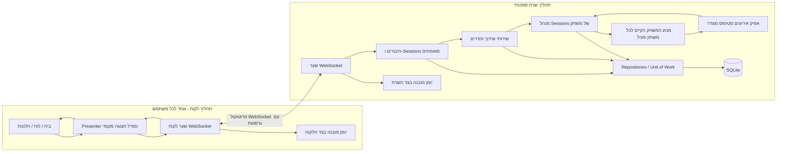

# המעבר של KFChess לארכיטקטורת לקוח-שרת - תוכנית עבודה ראשית

## 1. מטרת המסמך

מסמך זה מגדיר מפת דרכים לינארית למעבר של KFChess מיישום מקומי הפועל בתהליך יחיד למערכת לקוח-שרת מופרדת, הכוללת תקשורת WebSocket, משתמשים מאומתים, דירוגים מתמידים, שידוך לפי דירוג, חדרים פרטיים, צופים, טיפול בניתוקים ותצפיתיות מובנית.

התוכנית מבוססת על:

- מפרט בן שבעה עמודים בשם `CTD 26 - KungFu Chess Server - The Server`;
- הדרישות שנמסרו יחד עם בקשת התכנון; וכן
- סקירה לקריאה בלבד של מבנה המאגר ושל נקודות ההפרדה הארכיטקטוניות הקיימות.

זוהי תוכנית יישום, ולא קביעה שלפיה התנהגויות מוצר שטרם הוחלטו כבר נסגרו. נושאים המחייבים אישור מבעל המוצר או מהגורם הטכני מרוכזים ב[סעיף 15](#15-שאלות-הבהרה-ושערי-החלטה). עד לקבלת החלטות אלה, יש לממש את המשימות המושפעות באמצעות ממשקים וכפילי בדיקה, ולא באמצעות בחירות בלתי הפיכות.

## 2. עקיבות מול דרישות המקור

| הנחיית המקור | שלב מסירה מתוכנן |
| --- | --- |
| מימוש אפיק פרסום/מנוי | שלב 1 |
| שימוש באפיק לעדכון ניקוד, יומן מהלכים, צלילים והנפשות תחילת/סיום משחק | שלב 1 |
| הפעלת שרת מקומי פשוט עם תקשורת WebSocket | שלב 2 |
| שליחת פקודות כגון `WQe2e5` וקבלת מצב משחק | שלב 2 |
| תמיכה בשני לקוחות; השחקן הראשון לבן והשני שחור | שלב 2 / שלב 3א |
| כניסת הדגמה עם שם משתמש דרך המעטפת ולא דרך הממשק הגרפי | שלב 3א |
| כניסה עם שם משתמש וסיסמה הנשמרים ב-SQLite בצד השרת | שלב 3ב |
| שחקנים חדשים מתחילים בדירוג 1200 והדירוג משתנה באמצעות Elo | שלב 4 |
| `Play` מחפש יריב בטווח דירוג כולל של 100+/- | שלב 4 |
| השידוך ממתין עד דקה ולאחר מכן מציג הודעת כישלון | שלב 4 |
| שחקן שנותק מפסיד אוטומטית לאחר 20 שניות | שלב 6 |
| הלקוח מציג ספירה לאחור במשך תקופת החסד | שלב 6 |
| `Room` פותח חלון עם שדה מזהה חדר ופעולות Create / Join / Cancel | שלב 5 |
| המשתתף השני בחדר הוא השחור; הבאים אחריו הם צופים | שלב 5 |
| הלקוח והשרת שומרים יומנים לכל פעילות לקוח/שרת | שלב 6, עם תשתית בשלב 0 |

## 3. הערכת המצב הנוכחי

הפרויקט הנוכחי הוא יישום Python 3.11 עם לקוח גרפי המבוסס על OpenCV ומריץ פקודות טקסטואלי. המימוש הראשי נמצא תחת `kongfu_chess/`; התיקייה `vpl_submit/` היא עותק הגשה שנוצר אוטומטית, ואסור להפוך אותה למקור אמת נוסף.

גבולות קיימים שכדאי לשמר ולחזק:

- `Game` משמש חזית יישומית לפעולות משחק.
- `GameEngine` מתאם חוקים, זמן, תנועה, לכידות ושינויי מצב.
- `GameSnapshot` מספק מודל קריאה בלתי משתנה המתאים להעברה ברשת.
- `SynchronousEventBus` ואירועי תחום בלתי משתנים כבר מיישמים את תבנית Observer.
- `GameView` מצייר תמונות מצב בלי לשנות את הנתונים הפנימיים של המנוע.
- משתפי הפעולה של המנוע כבר משתמשים במדיניות מוזרקת ובפרוטוקולים מבניים.
- חלק מערכי התצורה מרוכזים ב-`kongfu_chess/config.py` ובהגדרות מנוע בלתי משתנות.

פערים מול מצב היעד:

- לולאת הממשק הגרפי יוצרת ומפעילה את `Game` באותו תהליך;
- אין פרוטוקול רשת, מחזור חיים של חיבור/Session או תעבורת WebSocket;
- אפיק האירועים מינימלי וממוקד כיום בעיקר באירועי תחום של המנוע;
- אין יישום שרת, מאגר Sessions של משחק או שירות להקצאת שחקנים;
- אין אימות משתמשים, גיבוב סיסמאות, מעטפת SQLite או מיגרציות;
- אין תור שידוך, שירות Elo, מאגר חדרים או הרשאות צופה;
- אין מכונת מצבים לתקופת חסד בחיבור מחדש או שעון הפסד סמכותי בצד השרת;
- אין מדיניות אחידה ליומנים מובנים או מזהי מתאם מקצה לקצה;
- יש לבחון את `Game.state` ואת המאפיינים הפנימיים שנועדו לתאימות מול דרישת הכימוס המחמיר, לפני חשיפת גבול השרת.

## 4. ארכיטקטורת היעד

השרת חייב להיות סמכותי. לקוחות רשאים לבקש פעולות, אך לעולם לא להחליט אם מהלך חוקי, להקצות צבע, לסגור תוצאה, לעדכן דירוג או לקבוע שניתוק גרם להפסד.



### 4.1 כיוון תלויות מחייב

1. מודל התחום והחוקים אינם מכירים OpenCV, WebSockets, SQLite, JSON או ספריות רישום יומן.
2. שירותי היישום מתאמים פעולות תחום דרך Ports וממשקים.
3. מתאמי תשתית מממשים WebSocket, SQLite, שעונים, מזהים, גיבוב סיסמאות ויומני קבצים.
4. הלקוח מכיר DTO-ים של הפרוטוקול ומודלי תצוגה, אך אינו מייבא או משנה אובייקטי משחק של השרת.
5. הגדרות הפרוטוקול המשותפות מכילות חוזים הניתנים לסריאליזציה בלבד; הן אינן הופכות למקום אחסון אקראי ללוגיקת שרת או ממשק.

### 4.2 חלוקת אחריות מוצעת לחבילות

אפשר לשנות את השמות המדויקים בשלב 0, אך לכל אחריות חייב להיות בעלים יחיד.

```text
kongfu_chess/
|-- domain/ או התיקיות הקיימות engine, model, realtime, rules
|-- application/
|   |-- game_sessions/
|   |-- authentication/
|   |-- matchmaking/
|   `-- rooms/
|-- protocol/
|   |-- envelopes.py
|   |-- commands.py
|   |-- events.py
|   `-- serialization.py
|-- server/
|   |-- websocket_gateway.py
|   |-- connection_registry.py
|   |-- composition_root.py
|   `-- main.py
|-- client/
|   |-- websocket_gateway.py
|   |-- presenter.py
|   |-- connection_state.py
|   `-- main.py
|-- persistence/
|   |-- sqlite_connection.py
|   |-- migrations/
|   `-- repositories/
|-- observability/
|   `-- logging.py
`-- configuration/
    |-- models.py
    `-- loader.py
```

יש להעביר תיקיות קיימות רק אם התועלת עולה על סיכון ההגירה. תחילה אפשר לעטוף את המנוע הנוכחי בגבולות החדשים, ולדחות ארגון פיזי עד שהבדיקות מגנות על ההתנהגות.

## 5. כללי הנדסה החלים בכל שלב

### 5.1 DRY - אין לחזור על עצמנו

- יש להגדיר פעם אחת כל הודעת פרוטוקול, קוד שגיאה, סיבת תוצאה, נוסחת דירוג, כלל Timeout ומעבר מחזור חיים.
- יש לייצר או לייבא serializers של לקוח ושרת מאותן הגדרות DTO, במקום לתחזק מילוני מחרוזות מקבילים.
- `kongfu_chess/` נשאר מקור האמת; את `vpl_submit/` מייצרים מחדש רק באמצעות תהליך ההכנה הקיים, אם התוצר עדיין נדרש.
- אין לשכפל אימות חוקי משחק בלקוח. הלקוח רשאי לבצע בדיקות קלט לא-סמכותיות לצורכי שימושיות בלבד.

### 5.2 עקרון האחריות היחידה - SRP

- יש להפריד בין תעבורה, אימות, שידוך, חדרים, תזמור משחק, התמדה, ציור, צליל, יומן ותצורה.
- מטפלי WebSocket צריכים להיות דקים: deserialization, אימות מעטפת, authentication/authorization, ניתוב לשירות יישומי אחד ו-serialization של התוצאה.
- Repositories אחראים להתמדה ולא להחלטות תחום.
- Presenters אחראים למצב התצוגה, לא למנגנון ה-Socket או לחוקים עסקיים.

### 5.3 אפס קבועים המקודדים בתוך הלוגיקה

יש להשתמש בתצורה מטיפוס מוגדר, עם ערכי ברירת מחדל שנבדקים ודריסות לפי סביבה. לכל הפחות, יש להוציא לתצורה:

- כתובת bind, פורט, כתובת WebSocket ציבורית ונתיבי תעבורה;
- גרסת פרוטוקול וגודל הודעה נכנסת מרבי;
- מרווח heartbeat/ping ו-Timeout לחיבור לא פעיל;
- מרווח simulation/tick אם המשחק נשאר בזמן אמת;
- חלון הדירוג ומשך ההמתנה לשידוך;
- תקופת החסד לאחר ניתוק;
- דירוג התחלתי, סולם Elo, מדיניות K-factor, כלל עיגול ורצפת דירוג אם קיימת;
- אורך/אלפבית מזהה חדר ומגבלות קיבולת;
- נתיב מסד הנתונים, busy timeout, journal mode ומדיניות מיגרציות;
- פרמטרים לגיבוב סיסמה ואורך חיי Session;
- תיקיית יומנים, רמה, רוטציה לפי גודל/זמן, שמירה ושדות להשחרה;
- תוויות ממשק, הודעות חלון, שמות חלונות ותבנית תצוגת הספירה לאחור.

סדר קדימות מומלץ: תצורת ברירת מחדל הנשמרת במאגר -> קובץ תצורה לסביבה -> משתני סביבה -> דריסות מפורשות בשורת הפקודה. אין לשמור סודות בקובצי תצורה במאגר.

### 5.4 כימוס מחמיר

- יש לחשוף תמונות מצב בלתי משתנות, אובייקטי תוצאה וממשקים צרים.
- אין להחזיר תאי לוח בני שינוי, מבנה פנימי של תורים, אוספי חברי חדר, חיבורי Repository או רשימות מנויים.
- בגבול השרת יש להחליף קריאות ישירות של `Game.state` בשאילתות מפורשות או snapshots.
- קוד התעבורה לא ייגש למאפיינים פרטיים של המנוע.
- לכל משחק פעיל, חיבור, כרטיס שידוך וחדר יהיה מזהה אטום.

### 5.5 הגדרת השלמה לכל פריט עבודה

משימה הושלמה רק כאשר:

- קוד הייצור והבדיקות האוטומטיות נמסרים יחד;
- התצורה הרלוונטית ומקרי השגיאה מתועדים;
- היומנים כוללים הקשר שימושי בלי פרטי זיהוי רגישים או סודות;
- ממשקים ציבוריים כוללים type hints ותיעוד התנהגות קצר;
- שום שכבת UI, תעבורה, התמדה או תחום אינה עוקפת את הגבול שהוקצה לה;
- בדיקות היחידה, האינטגרציה והקצה-לקצה הרלוונטיות עוברות;
- הדגמת השלב וקריטריוני היציאה הושלמו.

## 6. שלב 0 - גילוי, החלטות ורשת ביטחון

### 6.1 מטרה ויעד ארכיטקטוני

לקבע את החוזה ההתנהגותי, להגן על המנוע הנוכחי באמצעות בדיקות, ולקבוע מוסכמות כלל-פרויקטליות לתצורה, לפרוטוקול ולאיכות לפני הכנסת מצבי כשל של מערכת מבוזרת.

### 6.2 משימות הנדסיות קונקרטיות

#### ארכיטקטורה משותפת וניהול הפרויקט

1. לפתור את השאלות החוסמות בסעיף 15 ולתעד את התשובות כרשומות החלטה ארכיטקטוניות קצרות (ADR).
2. להגדיר מילון מושגים למוצר: משתמש, חיבור, Session מאומת, כרטיס שידוך, חדר, מושב שחקן, צופה, Session משחק, תוצאת משחק, הפסד טכני וחיבור מחדש.
3. למפות APIs ציבוריים קיימים ולסווג כל אחד ככזה שיש לשמר, לעטוף, להוציא משימוש או להסיר.
4. לשרטט מפות תלות נוכחית ויעד; להוסיף בדיקת תלות אוטומטית שמונעת מהתחום לייבא תשתיות לקוח/שרת/התמדה.
5. לעבוד באמצעות ענפים לכל שלב או בקשות שינוי קטנות לפי חתך אנכי; להימנע משכתוב לקוח-שרת גדול אחד.
6. לתעד תוצאת בדיקות תקינה וליצור fixtures לבדיקות רגרסיה של מהלכים חוקיים/לא חוקיים, תנועה בו-זמנית אם נדרשת, לכידה, ניקוד, סוף משחק ותמונות מצב בלתי משתנות.
7. להגדיר שערי שלב מדידים ותסריט הדגמה לשני תהליכי לקוח מקומיים ולתהליך שרת אחד.

#### תצורה

1. לממש מודל הגדרות מטיפוס מוגדר, המחולק ל-`server`, `client`, `protocol`, `auth`, `matchmaking`, `rating`, `rooms`, `database` ו-`logging`.
2. לאמת בזמן אתחול פורטים לא חוקיים, Timeout שלילי, חלונות דירוג בלתי אפשריים, פרמטרי גיבוב לא בטוחים ונתיבי נתונים/יומן שאינם ניתנים לכתיבה; להחזיר שגיאות מעשיות.
3. לספק תצורות פיתוח ובדיקה עם פורטים זמניים ומסדי נתונים זמניים ומבודדים.
4. להזריק ממשקי שעון ומחולל מזהים, כך שניתן יהיה לבדוק באופן דטרמיניסטי Timeout, ספירות לאחור, מזהי חדר ומזהי מתאם.

#### תכנון הפרוטוקול

1. להגדיר מעטפת עם גרסה לפני מימוש WebSockets. שדות מומלצים:
   - `protocol_version`;
   - `message_type`;
   - `message_id`;
   - `correlation_id` לקישור בין בקשה לתגובה;
   - `sent_at` או מטא-נתוני רצף שרת, אם נדרשים;
   - `payload`;
   - הקשר אופציונלי כגון `game_id`, `room_id` או Session מאומת, לפי הצורך.
2. להפריד פקודות לקוח מאירועי שרת. פקודות מבטאות כוונה; אירועים מדווחים על תוצאה סמכותית.
3. להגדיר מעטפת שגיאה יציבה עם קוד קריא למכונה, מפתח/טקסט הודעה לבני אדם, שדה המגדיר אם אפשר לנסות שוב ומזהה מתאם.
4. להחליט על אסטרטגיית מצב: snapshot מלא בעת join/reconnect, ולאחר מכן snapshots מלאים או deltas מסודרים במהלך המשחק.
5. להגדיר מגבלות גודל הודעה, טיפול בהודעה פגומה, גרסה לא נתמכת, הודעה כפולה וכללי סדר.

#### תשתית תצפיתיות

1. להגדיר סכמת יומן מובנה ומדיניות השחרת מידע משותפת.
2. להקצות שדות מתאם: תהליך, רכיב, מזהה חיבור, משתמש, משחק, חדר, הודעה, סוג אירוע, תוצאה, משך וקוד שגיאה.
3. להוסיף כלי בדיקה המוודאים שסיסמאות, hashes וסודות Session לעולם אינם מופיעים ביומנים.

### 6.3 תבניות ומבנים מוצעים

- Architecture Decision Records.
- Ports and Adapters / Hexagonal Architecture.
- Composition Root לחיבור תלויות.
- אובייקט תצורה מטיפוס מוגדר עם validation.
- DTO-ים ו-serializers מפורשים בגבול שבין התהליכים.
- שעון מזויף ומחולל מזהים דטרמיניסטי לבדיקות.

### 6.4 סיכונים ומקרי קצה

- התייחסות למנוע הקיים כאל משחק מבוסס תורות, או להפך, תשנה את אימות הפקודות ואת תזמון השרת.
- ארגון מחדש של תיקיות לפני הוספת כיסוי רגרסיה עלול לערב שינויי התנהגות עם העברות קבצים.
- פרוטוקול שמוגדר באופן רופף יחייב שינויים סימולטניים בכל רכיבי הלקוח והשרת.
- סריאליזציה ישירה של dataclasses פנימיים עלולה לחשוף בטעות שדות בני שינוי או פרטי מימוש.
- יש לשמר עבודה קיימת שטרם בוצע לה commit ולהפריד אותה מ-commits של מימוש תוכנית זו.

### 6.5 אימות וקריטריוני יציאה

- כל ה-ADRs החוסמים אושרו.
- הבדיקות הקיימות עוברות עם תצורת בדיקה נקייה.
- סכמות ודוגמאות של פרוטוקול v1 נבדקו.
- בדיקות תצורה והשחרת מידע עוברות.
- המשחק המקומי הקיים עדיין פועל ללא שינוי.

## 7. שלב 1 - הפשטת ערוץ התקשורת / אפיק פרסום-מנוי

### 7.1 מטרה ויעד ארכיטקטוני

להסיר צימוד ישיר בין מעברי מצב סמכותיים לבין תופעות לוואי של שכבת התצוגה. יש להשלים את הפשטת האירועים בתוך התהליך לפני העברת אירועים ברשת.

האפיק הוא מנגנון אירועי תחום/יישום בתוך תהליך, אינו תחליף ל-WebSockets, ואינו בהכרח broker חיצוני. Broker חיצוני אינו נחוץ לשרת בתהליך יחיד לפי הדרישות הנתונות, אלא אם דרישות קנה מידה עתידיות יצדיקו אותו.

### 7.2 משימות הנדסיות קונקרטיות

#### Backend/תחום

1. לבחון את הסמנטיקה של `SynchronousEventBus`: מנוי כפול, ביטול מנוי, סדר מנויים, publish רקורסיבי, בידוד חריגות וניקוי מחזור חיים.
2. להגדיר אירועים בלתי משתנים לכל התוצאות הנדרשות. להשתמש מחדש באירועים הקיימים כאשר הם נכונים ולהוסיף רק מושגים חסרים, כגון:
   - שינוי ניקוד;
   - רישום/השלמת מהלך;
   - התחלת משחק;
   - סיום משחק;
   - בקשת צליל או, עדיף, אירוע תחום שממנו הלקוח גוזר צליל;
   - רמז הנפשה או מעבר מחזור חיים שממנו הלקוח גוזר הנפשה.
3. לגרום לשינוי הניקוד ולשינוי היסטוריית המהלכים לנבוע מאותו מעבר סמכותי. אין לחשב אותם מחדש בנפרד ב-renderer.
4. להוסיף מתאם מנוי שממיר אירועי תחום נבחרים לאירועי פרוטוקול חיצוניים בלי לחשוף אובייקטים פנימיים.
5. להגדיר מדיניות כשל למנויים. כשל במנוי צליל/יומן לא ישחית ולא יבטל מהלך חוקי שהושלם.
6. לנהל במפורש את חיי המנויים לכל Session משחק כדי למנוע שמירת משחקים בזיכרון ודליפות.

#### Frontend/לקוח

1. להוסיף dispatcher בצד הלקוח לאירועי יישום נכנסים.
2. ליצור מנויים/בקרים נפרדים עבור:
   - עדכון לוח ניקוד;
   - תצוגת יומן מהלכים;
   - השמעת שמע;
   - הנפשת פתיחת משחק;
   - הנפשת סיום משחק.
3. להבטיח idempotency בתצוגה: קבלת אותו מצב סמכותי פעמיים לא תוסיף ניקוד או רשומת מהלך פעמיים.
4. מנויי התצוגה יצרכו DTO-ים בלתי משתנים של הלקוח ולא אובייקטי מנוע.

#### מסד נתונים

אין צורך במסד נתונים מתמיד בשלב זה. יש להגדיר ממשק מנוי להתמדה רק אם אחסון replay/audit אושר כדרישה; אין להוסיף SQLite מוקדם רק כדי לספק את שלב האפיק.

### 7.3 תבניות ומבנים מוצעים

- Observer / Publish-Subscribe.
- Domain Events בלתי משתנים.
- מתאם Event-to-Protocol.
- Presenter או Model-View-Presenter למסכי OpenCV.
- אובייקט תוצאה או callback לטיפול בשגיאות מנוי לא-קריטיות.

### 7.4 סיכונים ומקרי קצה

- רקורסיית אירועים אם מנוי מפרסם באופן סינכרוני את אותו סוג אירוע.
- מנוי איטי אחד חוסם את לולאת המשחק הסמכותית.
- חריגה במנוי מונעת הפעלה של מנויים מאוחרים יותר.
- תופעות UI כפולות לאחר retransmission או reconnect.
- בלבול בין עובדות תחום (`PieceCaptured`) לבין הוראות תצוגה (`PlaySound`). יש להעדיף עובדות עד לגבול הייעודי לתצוגה.
- פרסום אירוע לפני שהלוח והניקוד עקביים פנימית.

### 7.5 אימות וקריטריוני יציאה

- בדיקות יחידה מכסות subscribe/unsubscribe, איטרציה יציבה, רישום כפול, חריגות מנוי וסדר אירועים.
- ניקוד ויומן מהלכים מתעדכנים אך ורק מאירועים/snapshots סמכותיים.
- אפשר להפעיל או לכבות מתאמי צליל והנפשות התחלה/סיום בלי לשנות את המנוע.
- הסרת כל מנויי התצוגה אינה משנה את תוצאות המשחק.
- כל בדיקות המנוע הקיימות נשארות ירוקות.

## 8. שלב 2 - תהליכי לקוח ושרת נפרדים באמצעות WebSockets

### 8.1 מטרה ויעד ארכיטקטוני

להפעיל את הלקוח הגרפי ואת מנוע המשחק הסמכותי בתהליכים נפרדים לחלוטין. לתמוך בשני לקוחות WebSocket בו-זמנית, בצבעים שמקצה השרת, בפקודות ואירועים דו-כיווניים ובציור מותאם לנקודת המבט.

### 8.2 משימות הנדסיות קונקרטיות

#### Backend/שרת

1. להוסיף Composition Root לשרת שטוען תצורה, יומן, שעון, repositories/adapters, שער WebSocket ושירותים יישומיים.
2. לממש שער WebSocket שאחראי רק למחזור חיי חיבור, framing, מגבלות גודל, serialization ו-dispatch.
3. לממש מאגר חיבורים עם מזהי חיבור אטומים ומצבים מפורשים כגון `CONNECTED`, `IDENTIFIED`, `SEATED`, `SPECTATING`, `DISCONNECTED` ו-`CLOSED`, לפי הצורך.
4. לממש מנהל Sessions של משחק שבבעלותו בדיוק מופע `Game` אחד ומחזור simulation אחד לכל משחק פעיל.
5. לנתב פקודות שחקן ל-Session הנכון ולדחות פקודות מ:
   - חיבורים לא מוכרים;
   - צופים;
   - שחקן שמנסה לפקד על כלי היריב;
   - חיבור שאינו משויך למשחק;
   - שחקן לפני תחילת המשחק או אחרי סיומו;
   - הודעות פגומות, ישנות או בגרסה לא נתמכת.
6. להקצות את השחקן הראשון ללבן ואת השני לשחור בזרימת ההדגמה של שלב 2.
7. להתחיל משחק רק כאשר שני המושבים הנדרשים מאוישים; לפרסם אירוע התחלה ו-snapshot מלא ראשוני.
8. להפוך את זמן השרת לסמכותי. אם המשחק בזמן אמת, השרת מקדם כל משחק באמצעות scheduler/tick service; לקוחות לעולם אינם שולחים `wait` כדי לקדם זמן קנוני.
9. לשדר מצב סמכותי לשני השחקנים עם מספרי רצף עולים לכל משחק.
10. לעצור ולשחרר באופן דטרמיניסטי Sessions ומנויי אירועים שהושלמו או ננטשו.

#### פרוטוקול משותף

1. לממש סכמות בקשות ואירועים לכל הפחות עבור:
   - hello ומשא ומתן על גרסה;
   - identify/login זמני;
   - join game או תור הדגמה;
   - הקצאת מושב;
   - תחילת משחק;
   - שליחת מהלך/פעולה;
   - קבלה/דחייה של פקודה;
   - snapshot/עדכון מצב;
   - סיום משחק;
   - שגיאת פרוטוקול/יישום.
2. להגדיר את payload המהלך במדויק. אם `WQe2e5` נשאר דרישה, יש לפרש אותו במתאם פרוטוקול יחיד ולהמיר מיד לפקודה מטיפוס מוגדר; אין להעביר מחרוזות גולמיות למנוע.
3. להוסיף מזהה פקודה/הודעה שנוצר בלקוח כדי שניתן יהיה לבטל כפילויות לאחר ניסיון חוזר.
4. להגדיר מספרי רצף שרת והתנהגות לקוח במקרה של פערים, כפילויות או הודעות שלא לפי הסדר.
5. להגדיר מדיניות תאימות לאי-התאמה בגרסת הפרוטוקול.

#### Frontend/לקוח

1. לפצל את נקודת הכניסה הגרפית הנוכחית להרכבת UI ולשער לקוח WebSocket.
2. להסיר יצירה של `Game`/`Board` מנתיב לקוח הייצור.
3. לתרגם לחיצות או מחוות לוח לכוונות שחקן מטיפוס מוגדר ולשלוח אותן דרך השער.
4. לצייר רק את ה-snapshot הבלתי משתנה האחרון שאישר השרת, בתוספת מצב UI מקומי לא-סמכותי שהוגדר במפורש.
5. לממש מצבי חיבור והודעות למשתמש: מתחבר, ממתין ליריב, הוקצה לבן/שחור, משחק פעיל, מתחבר מחדש, הסתיים ושגיאת תעבורה.
6. לממש נקודת מבט יחסית לצבע:
   - לבן רואה את נקודת המבט הקנונית של לבן;
   - שחור רואה לוח מסובב/הפוך אם יאושר;
   - המרת הקואורדינטות מתבצעת ב-mapper יחיד;
   - מהלכים נשלחים תמיד בקואורדינטות לוח קנוניות.
7. לחסום קלט מקומי כאשר המשתמש אינו יושב, צופה, אחרי סיום המשחק או כאשר חסר ללקוח מצב סמכותי.
8. להוסיף סגירה נקייה של ה-Socket ושל משאבי ה-UI.

#### מסד נתונים

עדיין אין צורך במסד משתמשים. יש לשים את מאגרי החיבורים והמשחקים בזיכרון מאחורי ממשקים, כך שיוכלו בעתיד להסתמך על מזהי משתמש מאומתים בלי שכתוב.

### 8.3 תבניות ומבנים מוצעים

- מודל Server-Authoritative.
- Gateway / Adapter עבור WebSockets.
- Command pattern לכוונות שחקן נכנסות.
- CQRS מצומצם: פקודות נכנסות, snapshots/events בלתי משתנים יוצאים.
- Aggregate לכל משחק או בעלות דמוית Actor על Game Session כדי לסדר mutations בטור.
- State pattern או מכונות מצבים מפורשות לחיי חיבור ומשחק.
- Anti-Corruption Layer להמרת DTO-ים מהתעבורה לפקודות תחום.

### 8.4 סיכונים ומקרי קצה

- שתי פקודות מגיעות במקביל ומשנות משחק אחד ללא serialization.
- אי-התאמה בקואורדינטות לקוח/שרת כאשר לוח השחור מסובב.
- לקוח איטי יוצר backpressure או חוסם משחקים אחרים.
- פקודות כפולות לאחר ניסיון חוזר גורמות למהלכים כפולים.
- עדכוני מצב מגיעים לאחר סיום משחק או עבור משחק קודם.
- ניתוק WebSocket בזמן handshake, הקצאת צבע או snapshot ראשון.
- תורי יציאה בלתי מוגבלים צורכים זיכרון.
- השרת שולח snapshots מהר יותר מיכולת הציור של הלקוחות.
- הסתמכות על timestamps, ניקוד, בעלות כלי או טענת תוצאה שהגיעו מהלקוח.

### 8.5 אימות וקריטריוני יציאה

- תהליך שרת אחד ושני תהליכי לקוח עצמאיים יכולים להשלים משחק מקומי.
- השחקן הראשון לבן והשני שחור.
- שני הלקוחות מקבלים מצב עקבי ומיפוי נקודת מבט נכון.
- חיבור צופה/לא משויך אינו יכול לשלוח מהלך, גם לפני השלמת מצב הצופה הרשמי.
- בדיקות חוזה מאמתות כל הודעת v1 בשני הכיוונים.
- בדיקות אינטגרציה מכסות הודעות פגומות, פקודות כפולות, סדר וקלט מקביל משני לקוחות.
- עצירת לקוח בכוח אינה מפילה את השרת או את הלקוח האחר.

## 9. שלב 3 - זהות, אימות והתמדה ב-SQLite

### 9.1 מטרה ויעד ארכיטקטוני

להציג זהות בשני צעדים מבוקרים: תחילה זהות לצורכי ההדגמה המבוקשת דרך המעטפת, ולאחר מכן אימות אמיתי בשם משתמש וסיסמה הנתמך במעטפת SQLite בצד השרת. ללקוח אסור לגשת ישירות ל-SQLite.

### 9.2 שלב 3א - נקודת ביקורת לשם משתמש בהדגמה

#### משימות

1. לבקש שם משתמש במעטפת הלקוח לפני פתיחת/כניסת הזרימה הגרפית של Home, כנדרש בשקופיות.
2. לאמת אורך, תווים מותרים, normalization וקלט ריק באמצעות תצורה ואובייקט ערך/validator יחיד לשם משתמש.
3. לשלוח את זהות התצוגה בפרוטוקול ולקשר אותה ל-Session החיבור.
4. להציג את שמות שני השחקנים ואת הצבעים שהקצה השרת.
5. לסמן מצב זה במפורש כלא-מאומת ולהגבילו לתצורת הדגמה/פיתוח.
6. לא למחזר את הזרימה הזמנית הזאת כתכנון אחסון הסיסמאות.

### 9.3 שלב 3ב - אימות באמצעות סיסמה והתמדה

#### משימות Backend/שרת

1. להגדיר `AuthenticationService` שבבעלותו מדיניות registration/login אך הוא מעביר אחסון וגיבוב לרכיבים ייעודיים.
2. להגדיר Port בשם `PasswordHasher` ולהשתמש בגיבוב סיסמה מודרני, salted ו-adaptive. אין לשמור סיסמה גלויה או הפיכה.
3. להגדיר Port בשם `UserRepository` ולממשו באמצעות SQLite.
4. ליצור Session שרת מאומת לאחר כניסה מוצלחת. לקשור משחקים, שידוך וחדרים למזהה המשתמש המאומת, ולא לשם משתמש ששלח הלקוח.
5. להגדיר, בהתאם לדרישות שיאושרו, התנהגות לכניסה כפולה של אותו משתמש, האטת ניסיונות כושלים, תפוגת Session, logout, אתחול שרת ושינוי פרטים.
6. להחזיר כשלי אימות כלליים שאינם חושפים אם שם משתמש קיים.
7. לוודא שיומנים כוללים מזהי משתמש/שמות רק לפי המדיניות, ולעולם לא סיסמאות, hashes או סודות Session.

#### משימות Frontend/לקוח

1. לאסוף שם משתמש וסיסמה במעטפת אם הנחיית השקופית עדיין תקפה; לבטל echo במסוף בעת הקלדת סיסמה.
2. לעולם לא לשמור credentials גולמיים בקובצי לקוח או ביומנים.
3. למדל מצבי אימות: מנותק מחשבון, בתהליך אימות, מאומת, נדחה, נותק ו-Session שפג.
4. להיכנס למסך Home רק אחרי אישור השרת.
5. להציג שגיאות קצרות וניתנות לתיקון בלי לחשוף פרטי שרת פנימיים.

#### משימות מסד נתונים

1. להוסיף migration runner וטבלת גרסת schema. אין ליצור schema ייצור באופן מזדמן מתוך repositories.
2. סכמת משתמש ראשונית מומלצת:

   ```text
   users(
       id PRIMARY KEY,
       username UNIQUE NOT NULL,
       normalized_username UNIQUE NOT NULL,
       password_hash NOT NULL,
       rating NOT NULL,
       created_at NOT NULL,
       updated_at NOT NULL
   )
   ```

3. לאתחל דירוג דרך ערך התצורה לדירוג התחלתי 1200, ולא באמצעות SQL literal החוזר במיגרציות ובשירותים.
4. להגדיר foreign keys, busy timeout, גבולות transaction ומדיניות גיבוי.
5. להשאיר SQL ומיפוי שורות בתוך מודולי repository/infrastructure.
6. להוסיף בדיקות repository עם מסדי נתונים זמניים מבודדים ובדיקות migration ממסד ריק.

### 9.4 תבניות ומבנים מוצעים

- Repository pattern.
- Unit of Work / גבול transaction מפורש כאשר מספר כתיבות חייבות להיות אטומיות.
- מתאם Password Hasher.
- שירות Authentication והקשר Session מאומת.
- תבנית מיגרציות למסד נתונים.
- Value Object לשם משתמש מנורמל.

### 9.5 סיכונים ומקרי קצה

- עמימות בין יצירת חשבון לבין login בלבד.
- שמות כפולים עקב רישיות או Unicode שקול.
- רישום מקביל של אותו שם מנורמל.
- נעילת כתיבה ב-SQLite וקריסת תהליך באמצע transaction.
- רישום בטעות של credentials או auth payload מלא.
- שמירת סיסמאות ישירות בגלל ניסוח הדרישה לשמור שם משתמש וסיסמה.
- שימוש במזהה חיבור כזהות מתמידה ומאומתת.
- משתמש שפותח שני לקוחות ותופס את שני המושבים.

### 9.6 אימות וקריטריוני יציאה

- אתחול עם מסד ריק מפעיל מיגרציות באופן דטרמיניסטי.
- מדיניות registration/login תואמת ל-ADR שאושר.
- סיסמאות מגובבות ולעולם אינן נרשמות ביומן או מוחזרות.
- אימות מוצלח שורד אתחול שרת בזכות התמדה ב-SQLite.
- credentials שגויים, שמות כפולים, נעילת מסד וגרסת schema פגומה/לא נתמכת מחזירים שגיאות נשלטות.
- חיבור לא מאומת אינו יכול להשתדך, ליצור/להצטרף לחדר, לצפות או לשלוח פקודות משחק.

## 10. שלב 4 - דירוג Elo ושידוך כללי (`Play`)

### 10.1 מטרה ויעד ארכיטקטוני

לספק נתיב `Play` כללי שמזווג משתמשים מאומתים בתוך חלון הדירוג המוגדר, מסתיים ב-Timeout צפוי, יוצר משחק מדורג ומעדכן את שני הדירוגים פעם אחת בלבד לאחר תוצאה כשירה.

### 10.2 משימות הנדסיות קונקרטיות

#### Backend של דירוג

1. לממש `EloCalculator` טהור יחיד עם פרמטרים הניתנים להגדרה ובדיקות מקיפות.
2. להשתמש בחישוב expected score הסטנדרטי, אלא אם המנהל יגדיר נוסחה אחרת:

   ```text
   E_A = 1 / (1 + 10 ^ ((R_B - R_A) / scale))
   R_A_new = R_A + K_A * (S_A - E_A)
   ```

   כאשר `S` הוא 1 לניצחון, 0.5 לתיקו ו-0 להפסד. קושי היריב מיוצג מטבעו באמצעות ה-expected score. סולם Elo, מדיניות K-factor, עיגול, טיפול בתיקו, סטטוס provisional ורצפת דירוג הם עדיין נושאים להחלטה.
3. לחשב את שני הדירוגים החדשים מאותו זוג דירוגים שלפני המשחק; אין לעדכן צד אחד ואז להשתמש בערכו החדש לחישוב האחר.
4. לשמור תוצאת משחק, סיבת סיום, דירוגים לפני/אחרי ואירועי דירוג בתוך transaction אחד.
5. לאכוף idempotency בעזרת מפתח תוצאה מדורגת ייחודי, כך שאירועי סיום כפולים לא יחילו Elo פעמיים.
6. להגדיר אם הפסד עקב ניתוק, resign, ביטול ומשחקים שהסתיימו לפני משך/מספר מהלכים מזערי נחשבים למדורגים.

#### Backend של שידוך

1. לממש `MatchmakingService` בנפרד מ-`RoomService`.
2. ליצור כרטיס שידוך אטום לכל משתמש, עם דירוג וזמן כניסה בלתי משתנים.
3. לשדך רק משתמשים ממתינים המתאימים הדדית בתוך גבול 100+/- הכולל שהוגדר.
4. לבחור ולתעד כלל הוגנות דטרמיניסטי; מומלץ: הכרטיס התואם הוותיק ביותר תחילה, ומרחק דירוג כשובר שוויון משני.
5. לדחות כניסה כפולה לתור ושידוך עצמי.
6. להסיר כרטיס לאחר שידוך, ביטול מפורש, logout, ניתוק לפי מדיניות או Timeout מוגדר של 60 שניות.
7. להבטיח ששידוך נשמר אטומית, כך ששחקן אחד לא יוקצה לשני משחקים עקב בקשות מקבילות.
8. לבדוק מחדש תוקף authentication/session מיד לפני יצירת המשחק.
9. להקצות צבעים לפי המדיניות שאושרה וליצור רשומת משחק מדורג.
10. לשלוח אירועי כניסה לתור, ביטול תור, מציאת משחק ו-Timeout שידוך.

#### Frontend/לקוח

1. להוסיף פעולת `Play` במסך Home.
2. להציג מצב תור וזמן המתנה שעבר/נותר על סמך deadline מהשרת.
3. לנטרל שליחות `Play` חוזרות כאשר כרטיס פעיל.
4. לספק Cancel אם דרישות המוצר מאשרות זאת.
5. בעת מציאת משחק, להציג את שמות השחקנים, דירוגי טרום-המשחק והצבעים לפני ההתחלה.
6. לאחר 60 שניות ללא יריב מתאים, להציג את הודעת אי-המציאה הנדרשת ולהחזיר את Home למצב שמיש.
7. בסיום, להציג תוצאה ושינוי דירוג רק אחרי אישור השרת שהעדכון נשמר.

#### מסד נתונים

1. להוסיף `matches` ו-`rating_events`, או שדות מבוקרים שקולים, דרך migrations.
2. שדות מומלצים למשחק: מזהים, מזהי משתמש לבן/שחור, דירוגים לפני/אחרי, תוצאה, מצב, דגל rated, סיבת סיום, זמני יצירה/התחלה/סיום וגרסת פרוטוקול/ruleset אם תאימות replay חשובה.
3. להוסיף unique constraint שמונע החלת דירוג מספר פעמים על אותו צמד משתמש/משחק.
4. להשאיר את תור ההמתנה החי בזיכרון בשרת בתהליך יחיד, אלא אם נדרשת במפורש התאוששות התור לאחר אתחול.

### 10.3 תבניות ומבנים מוצעים

- Strategy pattern למדיניות דירוג/K-factor.
- פונקציה טהורה או Value Object לחישוב Elo.
- שירות תור עם שעון מונוטוני מוזרק.
- Transaction Script או Unit of Work להשלמת משחק.
- Event handler אידמפוטנטי לסגירת דירוג.
- מכונת מצבים מפורשת למחזור חיי Match.

### 10.4 סיכונים ומקרי קצה

- שגיאות גבול בדיוק ב-100+/-.
- משתמש לוחץ Play פעמיים, מתחבר מחדש או פותח שני Sessions.
- שני כרטיסים תואמים נצרכים במקביל.
- משחק נוצר בדיוק כשאחד המשתתפים מתנתק.
- מרוץ בין Timeout התור לבין הקצאת משחק.
- שני הדירוגים אינם מתעדכנים אטומית.
- אירוע `GameEnded` כפול מחיל Elo פעמיים.
- עמימות בין סיום בלכידת מלך במאגר הקיים לבין חוקי מט/תיקו רגילים.
- אינפלציה/דפלציה בדירוג עקב עיגול בכל שלב ביניים במקום רק בתוצאה הסופית.

### 10.5 אימות וקריטריוני יציאה

- בדיקות יחידה מכסות דירוגים שווים, הפרשים גדולים, סימטריית ניצחון/הפסד/תיקו, עיגול, מדיניות K מוגדרת ואינווריאנטים.
- בדיקות תור מכסות 99+/-, 100+/-, 101+/-, הוגנות first-compatible, ביטול, כניסה כפולה, שידוך עצמי, Timeout ומרוצים.
- שני לקוחות מקומיים מאומתים יכולים ללחוץ Play, להשתדך, לשחק, לסיים ולראות עדכון דירוג מתמיד אחד בלבד.
- לקוח שלא מצא משחק בתוך 60 שניות מקבל אירוע Timeout יחיד ויכול להיכנס שוב לתור.
- אתחול שרת משמר דירוגי משתמש והיסטוריית משחקים שהושלמו.

## 11. שלב 5 - ניהול חדרים ומצב צופה

### 11.1 מטרה ויעד ארכיטקטוני

לספק זרימת חדר מותאם אישית הנפרדת משידוך מדורג כללי. יוצר החדר מקבל מזהה חדר, המשתתף הבא שהתקבל הופך לשחור בהתאם לכללי השקופית, וכל המשתתפים הבאים מצטרפים כצופים בזמן אמת ובקריאה בלבד.

### 11.2 משימות הנדסיות קונקרטיות

#### Backend של חדרים

1. לממש `RoomService` ייעודי; אין להעמיס את היכולת על תור השידוך.
2. למדל במפורש את מחזור חיי החדר, למשל `OPEN`, `READY`, `IN_GAME`, `FINISHED` ו-`CLOSED`.
3. ליצור מזהי חדר שקשה לנחש או שנבדקים להתנגשות באמצעות מחולל מוזרק ותבנית מוגדרת בתצורה.
4. בפעולת create, לרשום אטומית את החדר ולהחזיר את המזהה ואת החברות/המושב של היוצר.
5. בפעולת join, לנרמל ולאמת את מזהה החדר שסופק ולהחזיר קודי שגיאה יציבים עבור לא נמצא, סגור, מלא, ללא הרשאה או מצב לא חוקי.
6. לשמור מושבי שחקן לפי הכללים שיאושרו. לפי השקופיות, היוצר/המשתתף הראשון צפוי להיות לבן והמשתתף השני שחור, אך הדבר דורש אישור.
7. לקבל כל חבר נוסף המותר בתפקיד `SPECTATOR`, ללא הרשאות מהלך.
8. לשמור תצוגות חדר/חברים בלתי משתנות ולעולם לא לחשוף את אוסף החברות בר-השינוי.
9. לשדר אירועי חברות, מוכנות, התחלת משחק, מצב, ניתוק, חיבור מחדש וסיום לכל חברי החדר המורשים.
10. כאשר צופה מצטרף באיחור, לשלוח מטא-נתוני חדר ו-snapshot מלא וסמכותי לפני עדכונים חיים.
11. להגדיר ניקוי חדר כאשר היוצר עוזב, החדר מתרוקן, המשחק מסתיים, השרת נסגר או החדר מתיישן.
12. להפריד בין הרשאת גישה לחדר לבין הרשאה לשלוח פקודות שחקן.
13. להחליט ולממש אם משחקי חדר מדורגים; אסור לבחור ברירת מחדל שקטה.

#### Frontend/לקוח

1. להוסיף פעולת `Room` נפרדת במסך Home, לצד `Play`.
2. לפתוח dialog/window לחדר הכולל:
   - שדה טקסט יחיד למזהה חדר;
   - Create;
   - Join;
   - Cancel.
3. לאחר create/join מוצלח, להציג את מזהה החדר הקנוני בחלק העליון של המסך כנדרש.
4. להציג את תפקיד המשתמש: לבן, שחור או צופה.
5. עבור צופים, לנטרל פקודות לוח ולסמן חזותית מצב קריאה בלבד.
6. להבטיח שנקודת המבט לצופה תואמת למדיניות שתאושר ואינה משתמשת בטעות במיפוי המיועד לשחקן.
7. לצייר לצופה חדש מתוך snapshot מלא, ואז לצרוך עדכונים חיים לפי הסדר.
8. להציג שגיאות חדר בלי לסגור את היישום כולו.

#### מסד נתונים

1. להשאיר חברות פעילה בחדר בזיכרון עבור שרת לא-מתמיד בתהליך יחיד, אלא אם נדרשת במפורש התמדה.
2. לשמור משחקי חדר שהושלמו רק אם נדרשת היסטוריית משחקים או דירוג למשחקי חדר.
3. אין לשמור מזהי חיבור WebSocket זמניים כזהות משתמש מתמידה.

### 11.3 תבניות ומבנים מוצעים

- Room Aggregate עם מודל קריאה בלתי משתנה.
- הרשאות מבוססות תפקיד (`WHITE_PLAYER`, `BLACK_PLAYER`, `SPECTATOR`).
- State pattern / מכונת מצבים למחזור חיי חדר.
- Factory ליצירת מזהי חדר ללא התנגשויות.
- תבנית Snapshot-Then-Stream לצופים שמצטרפים באיחור.
- שירותים יישומיים נפרדים לנתיבי `Play` ו-`Room`.

### 11.4 סיכונים ומקרי קצה

- שני משתמשים מנסים לתפוס את המושב השחור בו-זמנית.
- משתמש שלישי שולח מהלך לפני שאירוע הקצאת התפקיד הגיע ללקוח.
- התנגשות מזהי חדר, הבדלי רישיות/רווחים או ניחוש שיטתי של מזהים.
- צופה מצטרף בין יצירת ה-snapshot לבין האירוע החי הבא ומפספס עדכון.
- מספר צופים בלתי מוגבל מכלה זיכרון או רוחב פס יוצא.
- היוצר מתנתק לפני הצטרפות יריב.
- שחקן עוזב וצופה מקודם בטעות ללא כלל מפורש.
- חדר שהושלם נשאר נגיש ללא הגבלת זמן.
- תוצאת משחק חדר משנה Elo בטעות כאשר המשחק אמור להיות ידידותי.

### 11.5 אימות וקריטריוני יציאה

- Create / Join / Cancel פועלים דרך החלון שנדרש.
- מזהה החדר מופיע בחלק העליון לאחר יצירה או הצטרפות מוצלחת.
- שני משתתפי המשחק הראשונים מקבלים את הצבעים הנכונים; כל משתמש נוסף הוא צופה.
- הרשאות השרת דוחות כל מהלך של צופה בלי קשר למצב ה-UI שלו.
- צופה מאוחר מקבל את המצב הנוכחי ואת העדכונים הבאים ללא פערים.
- בדיקות מקביליות מוכיחות שרק משתמש אחד יכול לקבל את המושב השחור.
- סגירת חדר וניקויו משחררים את כל המנויים וההפניות ל-Sessions.

## 12. שלב 6 - ניתוקים, Timeouts, אמינות ויומנים מובנים

### 12.1 מטרה ויעד ארכיטקטוני

להגדיר במפורש את התנהגות הכשל ולהפוך אותה לסמכותית בצד השרת. לתת למשתמשים תקופת חסד גלויה לחיבור מחדש, להחיל הפסד אוטומטי באופן דטרמיניסטי ולשמור יומני אבחון בטוחים בשני הצדדים.

### 12.2 משימות הנדסיות קונקרטיות

#### אמינות חיבור ו-Backend

1. להגדיר מתי חיבור נחשב אבוד: סגירת WebSocket, heartbeat שנכשל, שגיאת רשת או idle timeout בצד השרת.
2. לממש מכונת מצבי ניתוק בבעלות השרת:

   ```text
   CONNECTED -> DISCONNECTED_GRACE -> RECONNECTED
                              `----> FORFEITED -> ENDED
   ```

3. כאשר שחקן פעיל מתנתק, לחשב deadline סמכותי יחיד מתוך תקופת החסד המוגדרת של 20 שניות.
4. לשדר `PlayerDisconnected` עם המשתמש/המושב ו-deadline השרת ליריב ולצופים.
5. לאפשר ל-reconnect מאומת ותקף להחזיר את אותו מושב רק לפי מדיניות Session שאושרה.
6. בעת reconnect, לבטל אטומית את ההפסד הממתין, לשלוח snapshot מלא חדש ואז לחדש עדכונים מסודרים.
7. ב-deadline, לסגור הפסד טכני יחיד ואירוע סיום יחיד; המטפל חייב להיות idempotent.
8. להגדיר מדיניות לניתוק בו-זמני של שני שחקנים, נפילת שרת, סגירה יזומה של היישום והאם המשחק נעצר בתקופת החסד.
9. להבטיח ש-Timeout של שידוך משתמש באותה הפשטת זמן מונוטוני מוזרקת, אך נשאר מחזור חיים נפרד מהפסד עקב ניתוק.
10. להוסיף תורים מוגבלים, Timeout לשליחה, גודל הודעה מרבי, rate limits וניקוי לקוחות איטיים/מנותקים.

#### אמינות Frontend/לקוח

1. להציג ספירה לאחור לאחר ניתוק היריב באמצעות deadline שהגיע מהשרת, ולא באמצעות החלטה מקומית להתחיל 20 שניות.
2. ליישר את הספירה הנראית מול אירועי/תמונות מצב תקופתיים מהשרת כדי לצמצם סטיית שעון.
3. להציג מצב reconnecting של המשתמש עצמו ולחסום קלט משחק עד לסיום resynchronization.
4. לאחר חיבור מחדש, להחליף את המצב המקומי ב-snapshot מלא מהשרת לפני קבלת קלט.
5. להציג תוצאת הפסד ושינוי דירוג, אם המשחק מדורג, רק לאחר אישור סמכותי.
6. לטפל בשרת שאינו זמין, אי-התאמת גרסה, תפוגת authentication ומיצוי ניסיונות חוזרים באמצעות דרכי התאוששות ברורות.

#### יומן מובנה - שרת

1. להגדיר יומני קבצים במבנה JSON או מבנה שקול, עם רוטציה ושמירה.
2. לרשום אתחול שרת וסיכום תצורה כאשר סודות ונתיבים רגישים מושחרים.
3. לרשום פתיחה/סגירה של חיבור, תוצאת אימות, חיי תור, חיי חדר, יצירת/סיום משחק, תוצאת פקודה, deadline לניתוק/reconnect/forfeit, תקלות מסד וחריגות לא צפויות.
4. להשתמש במזהי מתאם במקום להדפיס כברירת מחדל מצבי לוח מלאים או credentials.
5. להוסיף trace אופציונלי של protocol payload לפיתוח בלבד, עם השחרת שדות ומגבלות גודל קשיחות.
6. להבטיח שכשל של לקוח אחד לא מפיל את התהליך; לרשום את החריגה ואת ההיקף שנפגע.

#### יומן מובנה - לקוח

1. לשמור יומני לקוח מתחלפים במיקום כתיב המוגדר בתצורה.
2. לרשום אתחול/גרסה, שינויי חיבור, מטא-נתוני הודעות יוצאות/נכנסות, מעברי מצב UI, שגיאות פרוטוקול, כשלי ציור וסגירה.
3. לקשר כל פקודת לקוח לתגובת השרת באמצעות מזהי הודעה/מתאם.
4. לעולם לא לרשום סיסמאות, סודות Session, hashes או הודעות authentication מלאות.
5. לחשוף את מיקום היומן דרך פקודת עזרה/אבחון בלי לחשוף יומנים למשתמשים אחרים.

#### מסד נתונים ועקביות

1. לשמור תוצאת משחק/הפסד סופית ושינויי Elo בתוך transaction אחד.
2. לשמור סיבת סיום כגון סיום רגיל, resign, הפסד עקב ניתוק, ביטול מנהלי או abort של השרת.
3. לאחר אתחול תהליך, לזהות משחקים שנשארו במצב פעיל ולהחיל את מדיניות ההתאוששות שאושרה; לעולם לא לדרג אותם פעמיים בשקט.

### 12.3 תבניות ומבנים מוצעים

- מכונת מצבים מפורשת למחזור חיי connection/reconnect.
- Deadline כמקור אמת במקום מונה שיורד.
- מנגנון Heartbeat/Keepalive.
- טיפול אידמפוטנטי בפקודות/אירועים.
- יומן מובנה עם מזהי מתאם ו-context binding.
- Circuit Breaker הוא אפשרות עתידית לתלויות חיצוניות; הוא אינו נחוץ ל-SQLite מקומי בלבד.

### 12.4 סיכונים ומקרי קצה

- ניתוקים כוזבים עקב UI איטי או event loop חסום.
- שעוני הלקוח והשרת אינם תואמים; deadline השרת חייב לגבור.
- reconnect ו-forfeit מתבצעים במקביל בדיוק ב-deadline.
- משתמש מתחבר מחדש משני לקוחות ושניהם תובעים אותו מושב.
- שני השחקנים מתנתקים או השרת עצמו נעצר.
- צופה איטי חוסם שידורים לשחקנים.
- רישום יתר של הודעות מכלה שטח דיסק או שומר מידע רגיש.
- SQLite נעול בדיוק כאשר יש לסגור תוצאת הפסד.
- המשתמש סוגר את היישום בכוונה אך מקבל אותה תקופת חסד כמו אובדן רשת, אלא אם resign מפורש.

### 12.5 אימות וקריטריוני יציאה

- הפרעת רשת מפעילה ספירה נראית ומאפשרת התאוששות תקפה לפני ה-deadline.
- פקיעה לאחר 20 שניות מייצרת בדיוק הפסד אחד וסגירת דירוג אופציונלית אחת.
- בדיקות מרוץ בדיוק בזמן reconnect/deadline מחזירות תוצאות דטרמיניסטיות.
- Timeout שידוך, תקופת ניתוק וניקוי חדר אינם מפריעים זה לזה.
- קובצי יומן לקוח ושרת עוברים רוטציה וכוללים מזהים ניתנים למעקב.
- בדיקות השחרה אוטומטיות מוכיחות שאין credentials או סודות ביומן.
- בדיקות עומס עם צופים איטיים/מנותקים אינן מעכבות עיבוד משחק סמכותי.

## 13. שלב 7 - הקשחה, מוכנות לשחרור והעברה לתפעול

### 13.1 מטרה ויעד ארכיטקטוני

להוכיח שהמערכת השלמה פועלת נכון תחת מקביליות וכשל, לארוז הפעלה מקומית שניתנת לשחזור ולתעד בעלות תפעולית.

### 13.2 משימות הנדסיות קונקרטיות

#### איכות ובדיקות

1. לבנות סביבת end-to-end אוטומטית שמפעילה שרת ומספר לקוחות headless.
2. לכסות Play לשני שחקנים, יוצר/יריב/צופה בחדר, הצטרפות צופה מאוחרת, כשל אימות, Timeout שידוך, reconnect מוצלח, פקיעת reconnect וסגירה נקייה.
3. להוסיף בדיקות property/invariant:
   - למשתמש יש לכל היותר כרטיס שידוך אחד;
   - למשחק יש לכל היותר מושב לבן אחד ושחור אחד;
   - צופים לעולם אינם משנים מצב משחק;
   - כל משחק מדורג נסגר לכל היותר פעם אחת;
   - מספרי רצף לעולם אינם יורדים בתוך משחק;
   - דירוגים מחושבים מאותו זוג ערכי טרום-משחק.
4. להוסיף בדיקות מקביליות לתפיסת מושב, הקצאת משחק, פקודות סימולטניות, אירועי סיום כפולים ותחרות על מסד נתונים.
5. להוסיף בדיקות soak למחזורי create/play/end/dispose חוזרים כדי לזהות דליפות מנויים, sockets, threads/tasks ו-file handles.
6. למדוד גודל snapshot, תדירות עדכון, latency, זיכרון לכל משחק פעיל ועלות fan-out לכל צופה מול יעדים שאושרו.

#### אבטחה ועמידות

1. לאמת כל הודעה נכנסת לפי schema, גודל, מצב, authentication ו-authorization.
2. להוסיף rate limits לאימות, פעולות תור, הצטרפות לחדר ופקודות משחק.
3. להשתמש ב-WebSockets מאובטחים (`wss`) ובתצורת תעודות לכל פריסה שאינה מקומית.
4. לתעד גיבוי/שחזור SQLite, מגבלות rollback של migrations, שמירת יומנים והרשאות מיקום הנתונים.
5. לבצע סקירת איומים עבור גניבת credentials, התחזות, replay, סריקת חדרים, הצפת payload, מהלכים לא מורשים וחשיפת יומנים.

#### אריזה ותפעול

1. לספק נקודות כניסה נפרדות ומתועדות לשרת וללקוח.
2. לספק תצורת פיתוח לדוגמה ללא סודות.
3. להוסיף בדיקות בריאות באתחול: תצורה תקפה, מסד הוגדר/נפתח, נתיב יומן ניתן לכתיבה וה-bind לפורט הצליח.
4. להוסיף סגירת שרת מדורגת: להפסיק לקבל חיבורים, לסגור/לבטל Sessions לפי מדיניות, לסגור sockets, לרוקן יומנים ולסגור משאבי מסד.
5. לעדכן תיעוד ארכיטקטורה, פרוטוקול, מסד, פתרון תקלות ותפעול.
6. לנהל checklist לשחרור ותוכנית rollback.

### 13.3 תבניות ומבנים מוצעים

- פירמידת בדיקות בדגש על contract ובדיקות אינטגרציה מרובות תהליכים.
- Threat modeling ובדיקות abuse cases.
- מתאם Graceful Shutdown.
- בדיקות Health/Readiness.
- גרסאות סמנטיות לפרוטוקול ול-schema.

### 13.4 סיכונים ומקרי קצה

- בדיקות מקומיות עוברות בעוד מרוצי תזמון מרובי תהליכים נשארים חבויים.
- מגבלות SQLite אם קנה המידה הצפוי חורג מתהליך/מחשב יחיד.
- אריזת לקוח ושרת עם גרסאות פרוטוקול שאינן תואמות.
- סגירה בזמן settlement של דירוג או migration.
- צופים וחדרים ארוכי חיים גורמים לדליפות זיכרון.
- התנהגות OpenCV/GUI שונה בין סביבות משפיעה על reconnect.

### 13.5 אימות וקריטריוני יציאה

- הסוויטה האוטומטית המלאה עוברת שוב ושוב, לרבות תרחישי מקביליות וריבוי תהליכים.
- יעדי latency, קיבולת והתאוששות שאושרו מתקיימים.
- לא נותרה פתוחה בעיית אבטחה בחומרה גבוהה מסקירת האיומים.
- מפתח חדש יכול להפעיל שרת, שני שחקנים וצופה בעזרת ההוראות בלבד.
- גיבוי/שחזור מסד והתאוששות מכשל תורגלו.
- בעל המוצר מאשר כל הנחיית מקור בסעיף 2.

## 14. ממשל מסירה וסדר עבודה מומלץ

### 14.1 סדר תלויות לינארי

1. החלטות ורשת ביטחון של שלב 0.
2. הפרדת אירועים ותצוגה של שלב 1.
3. חתך WebSocket של שלב 2 עם שני משתמשי demo/anonymous.
4. נקודת ביקורת לשם משתמש במעטפת - שלב 3א.
5. אימות אמיתי ו-SQLite - שלב 3ב.
6. שידוך Play מדורג - שלב 4.
7. חדרים מותאמים וצופים - שלב 5.
8. reconnect, timeouts, יומנים והקשחת כשל - שלב 6.
9. אימות שחרור והעברה לתפעול - שלב 7.

בדיקות אמינות ותשתית יומן מתחילות מוקדם יותר, אך שלב 6 הוא המקום שבו ההתנהגות המלאה הופכת לשער קבלה.

### 14.2 חתכים אנכיים מומלצים

יש לשמור על שינויים קלים לסקירה ולמסור חתכים דקים מקצה לקצה בסדר הבא:

1. Protocol hello דרך WebSocket מקומי.
2. לקוח אחד שולח מהלך מטיפוס מוגדר; השרת מחזיר snapshot אחד.
3. שני לקוחות מקבלים צבע ומצב מסונכרן.
4. האפיק מניע יומן מהלכים, ניקוד, צליל ותצוגת מחזור חיים.
5. זיהוי באמצעות שם משתמש במעטפת.
6. Registration/login באמצעות SQLite.
7. מחשבון Elo וסגירת תוצאה טרנזקציונית ללא UI.
8. תור `Play` ו-Timeout של 60 שניות.
9. יצירת חדר והושבת שחקן שני.
10. Snapshot-Then-Stream לצופה.
11. תקופת חסד לחיבור מחדש והפסד אוטומטי.
12. יומן תפעולי, עומס והקשחת שחרור.

### 14.3 נקודות ביקורת

בסוף כל שלב יש לקיים ארבע סקירות נפרדות:

- ארכיטקטורה: גבולות, כיוון תלות, כימוס ועמידה ב-ADRs.
- מוצר: התנהגות גלויה וניסוחים שטרם הוכרעו.
- איכות: בדיקות, מקרי מרוץ, מצבי כשל ורגרסיה.
- תפעול/אבטחה: תצורה, יומנים, אחסון, סודות והתאוששות.

אין להתחיל שלב תלוי כל עוד קריטריוני היציאה או ההחלטות החוסמות של קודמו פתוחים.

### 14.4 מרשם סיכונים ראשוני

| סיכון | השפעה | הפחתה / פעולת בעלים |
| --- | --- | --- |
| לא הוכרע אם המשחק בזמן אמת או מבוסס תורות | שינוי קריטי בפרוטוקול וב-scheduler | להכריע בשלב 0 לפני סגירת תכנון הפקודות והמצב |
| כלי ה-UI וזרימת Home/login המדויקת אינם ברורים | עבודה חוזרת בלקוח | לאשר אחריות shell מול GUI ואת כלי OpenCV/dialog |
| מדיניות Elo אינה מלאה | דירוגים שגויים או שנויים במחלוקת | לאשר פרמטרי נוסחה, כללי תוצאה מדורגת ועיגול ב-ADR |
| מדיניות reconnect/session אינה מלאה | חטיפת מושב או הפסדים לא הוגנים | להגדיר token/session לחיבור מחדש מאומת לפני שלב 6 |
| תחרות כתיבה ב-SQLite תחת משחקים מקבילים | אובדן/עיכוב settlements | transactions קצרים, WAL/busy timeout אם יאושר, בדיקות repository ויעד קנה מידה |
| הודעות פרוטוקול חושפות ייצוג פנימי של המנוע | צימוד חזק וכשלי תאימות | DTO-ים ייעודיים, אימות schema ובדיקות חוזה |
| fan-out לצופים אינו מוגבל | פגיעה בזיכרון/latency של השרת | לאשר מגבלות, תורים מוגבלים, backpressure ובדיקות עומס |
| עבודה קיימת ללא commit חופפת ל-refactoring | אובדן עבודה או merges קשים | למפות ולשמר עבודה קיימת; לבצע שינויים קטנים וממוקדים |

## 15. שאלות הבהרה ושערי החלטה

השאלות הבאות נשארו ללא מענה במכוון. יש לפתור אותן לפני שהשלב המושפע נחשב מוכן למימוש.

### 15.1 משחקיות וסמכות

1. האם משחק היעד הוא Kung-Fu Chess בזמן אמת, כפי שממומש במאגר עם תנועה מתוזמנת בו-זמנית, או שעל הגרסה המקוונת לאכוף תורות רגילים של לבן/שחור? הדבר משנה את תזמון השרת, סדר הפקודות, snapshots והתנהגות reconnect.
2. מה בדיוק מסיים משחק: לכידת מלך כפי שממומש כיום, מט/פט, resign, Timeout או כלל Kung-Fu Chess אחר?
3. מה בדיוק מקודד `WQe2e5`: צבע שחקן + סוג כלי + מקור + יעד, או מזהה כלי יציב וקואורדינטות? האם פורמט התעבורה חייב להישאר מחרוזת קצרה זו, או שניתן להשתמש ב-JSON מובנה?
4. אם הלקוח מבקש מהלך בעוד פקודה קודמת טרם אושרה, האם השרת צריך להכניס אותו לתור, לדחות אותו או לעבד לפי סדר הגעה סמכותי?
5. האם לוח השחור חייב להסתובב ב-180 מעלות? איזו נקודת מבט רואים הצופים?

### 15.2 לקוח ו-UI

6. האם שם המשתמש והסיסמה ייאספו תמיד במעטפת, גם במוצר הסופי, או שקלט מעטפת הוא רק אבן דרך לפני login גרפי?
7. המקור דורש חלון בסגנון Windows לחדר עם תיבת טקסט. האם זה חייב להיות dialog מקורי של Windows, חלון OpenCV או שכל dialog שולחני שקול מתקבל?
8. האם `Play`, `Room`, שמות שחקנים, דירוגים, שגיאות והספירה לאחור חייבים כולם להופיע בחלון OpenCV הקיים?
9. האם כבר קיימים נכסי שמע/מערכת שמע, ואילו אירועים מפעילים אילו צלילים? מהן הדרישות המדויקות להנפשות התחלה/סיום?
10. אילו טקסטים מדויקים ודרישות שפה/לוקליזציה חלים על כשלי אימות, Timeout שידוך, שגיאות חדר וספירת ניתוק?

### 15.3 אימות והתמדה

11. האם נדרש רישום עצמי, האם החשבונות נוצרים מראש או שהכניסה הראשונה יוצרת חשבון אוטומטית?
12. מהם כללי שם המשתמש, מדיניות הסיסמה, זרימת איפוס סיסמה ומדיניות login כפול?
13. האם Sessions מאומתים חייבים לשרוד הפעלה מחדש של לקוח או שרת, או שניתן להזין credentials מחדש?
14. האם אותו משתמש רשאי להיות מחובר ממספר לקוחות? אם כן, האם Sessions אלה יכולים להצטרף למשחקים שונים, לצפות במשחק של עצמם או לתפוס את שני המושבים?
15. מלבד משתמשים ודירוגים, האם SQLite חייב לשמור היסטוריית משחקים, מהלכים/replays, חדרים, משחקים פעילים, Sessions או יומני audit?
16. מהן דרישות הגיבוי, השמירה והפרטיות לנתוני משתמש ומשחק?

### 15.4 Elo ושידוך

17. איזה סולם Elo ואיזו מדיניות K-factor נדרשים? האם K משתנה לפי דירוג, מספר משחקים או provisional status?
18. כיצד מעגלים תוצאת Elo שברית, והאם קיימת רצפת דירוג?
19. האם תיקו אפשרי, ואיזו תוצאת שרת מתורגמת לתיקו?
20. האם הפסד עקב ניתוק, resign ידני, משחק קצר מאוד ומשחק חדר הם מדורגים?
21. האם גבול 100+/- כולל את הקצה, והאם הוא נשאר קבוע לכל 60 השניות או מתרחב עם הזמן?
22. אם מספר משתמשים תואמים ממתינים, האם יש להעדיף את הכרטיס הוותיק, את הדירוג הקרוב ביותר או מדיניות אחרת?
23. כיצד מוקצים לבן ושחור בשידוך: סדר הצטרפות, בחירה אקראית, היסטוריה מתחלפת או איזון אחר שאינו תלוי דירוג?
24. האם משתמש רשאי לבטל שידוך לפני Timeout של דקה, ומה קורה אם הוא מתנתק בזמן ההמתנה?

### 15.5 חדרים וצופים

25. האם יוצר החדר תופס אוטומטית את המושב הלבן ולכן המצטרף הבא שחור, או שניתן ליצור חדר בלי להשתתף במשחק?
26. האם מזהי חדר תלויי רישיות, מה הפורמט/האורך הצפוי והאם חדרים תומכים בסיסמה או בהזמנה?
27. האם יש מספר מרבי של צופים? האם צופים יכולים להצטרף לאחר תחילת המשחק או לאחר סיומו?
28. האם שחקן מנותק יכול לקבל מחדש את מושבו בחדר, והאם צופה קיים יכול אי פעם להתקדם למושב שהתפנה?
29. מה קורה כאשר יוצר החדר עוזב לפני הצטרפות השחקן השני או במהלך משחק פעיל?
30. האם משחקי חדר מדורגים או ידידותיים כברירת מחדל?
31. האם עדכוני צופים מיידיים או מושהים בכוונה כדי למנוע סיוע חיצוני?

### 15.6 ניתוקים, פריסה ותפעול

32. בתקופת החסד של 20 שניות, האם המשחק הסמכותי נעצר, ממשיך או מקבל פעולות רק מהשחקן המחובר?
33. מה קורה אם שני השחקנים מתנתקים, לשרת אובד החיבור או תהליך השרת מופעל מחדש במהלך משחק?
34. האם סגירה יזומה של היישום נחשבת resign מיידי או מקבלת אותה תקופת חסד של 20 שניות?
35. אילו credentials או הוכחת Session חייב לקוח שמתחבר מחדש לספק כדי לקבל את מושבו?
36. האם השרת מקומי בלבד לצורך הערכה, זמין ברשת מקומית או חשוף לאינטרנט? האם TLS (`wss`) נדרש בסביבת היעד?
37. באילו מספרי שיא של משחקים מקבילים, משתמשים בתור, חדרים וצופים חייב השרת בתהליך יחיד לתמוך?
38. באילו מערכות הפעלה חייבים השרת והלקוח לתמוך?
39. איזה פורמט יומן, משך שמירה, שימוש מרבי בדיסק ורמת פירוט payload נדרשים?
40. איזה גודל צוות, מועד מסירה, קצב סקירות ותאריכי הדגמה נדרשים כדי להמיר את תוכנית התלויות ללוח זמנים ולהקצאת בעלים?

## 16. תרחיש קבלה סופי

שלב המימוש הושלם כאשר משתמש מאומת יכול להפעיל לקוח, להגיע ל-Home, לבחור `Play` או `Room` ולהשלים את הזרימות המאומתות הבאות:

1. `Play`: שני משתמשים תואמים בתוך גבול הדירוג המוגדר משתדכים בזמן ההמתנה המותר, מקבלים תפקידי לבן/שחור, מחליפים עדכוני משחק שאישר השרת בזמן אמת, משלימים משחק ומקבלים עדכון Elo מתמיד אחד ונכון.
2. Timeout שידוך: משתמש שלא נמצא לו יריב ממתין דקה מוגדרת, רואה הודעת כישלון יחידה וחוזר למסך Home שמיש.
3. חדר: היוצר מקבל מזהה חדר גלוי, משתמש שני מצטרף כשחור, משתמשים נוספים מצטרפים כצופים בקריאה בלבד וכולם רואים מצב סמכותי מסונכרן.
4. התאוששות מניתוק: אובדן חיבור של שחקן יוצר ספירה לאחור גלויה המבוססת על השרת; reconnect משחזר את המושב והמצב לפני ה-deadline, בעוד פקיעה מייצרת הפסד אוטומטי יחיד וכל סגירת דירוג שהוגדרה.
5. אבחון: הלקוח והשרת כותבים יומנים מובנים, מתואמים, מתחלפים ומושחרים שמספיקים לעקוב אחר הזרימה המלאה בלי לחשוף credentials.
6. ארכיטקטורה: הלקוח אינו מכיל החלטות סמכותיות על משחק או דירוג; השרת אינו מכיל לוגיקת ציור; שכבת ההתמדה אינה מכילה חוקי משחק; התצורה מחזיקה את כל הקבועים העסקיים ופרטי הפריסה; כל מצב בר-שינוי נשאר מכומס מאחורי ממשקים צרים.
