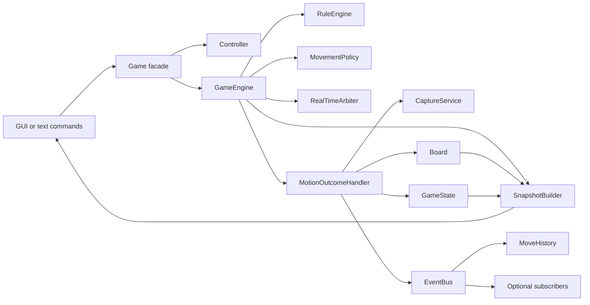

# Kong-Fu Chess

Kong-Fu Chess is a real-time chess engine written in Python. Unlike traditional
turn-based chess, several pieces may move at the same time. The engine resolves
timed movement, collisions, jumps, captures, rest periods, promotion, scoring,
and game-over conditions.

The project supports both a text-command interface for automated evaluation and
an OpenCV game window for interactive use.

## Running the project

The project targets Python 3.11. The graphical interface also requires
`opencv-python` and `numpy`; the test suite requires `pytest` and `pytest-cov`.

Run the graphical game:

```powershell
py -3.11 -m kongfu_chess.graphics.game_window
```

Press `Esc` to close the window.

Run the OpenCV network client for login, registration, Play matchmaking, and
Room entry (with the configured server running):

```powershell
py -3.11 -m kongfu_chess.client
```

The production client keeps all forms, keyboard input, buttons, errors, and
waiting states inside the Kung Fu Chess OpenCV window.

Run a text script from PowerShell:

```powershell
Get-Content my_input.txt -Raw | py -3.11 main.py
```

From Command Prompt (`cmd`), use:

```bat
py -3.11 main.py < my_input.txt
```

Run the complete test suite:

```powershell
py -3.11 -m pytest
```

The test configuration also creates an HTML coverage report in
`htmlcov/index.html`.

## Text input format

The command-line entry point accepts a board followed by commands:

```text
Board:
wR . bK
Commands:
click 50 50
click 250 50
wait 2000
print board
```

Supported commands are `click`, `jump`, `wait`, `promote`, and `print board`.
Board cells use two-character piece tokens such as `wP`, `bK`, and `wR`; `.`
represents an empty cell.

## Architecture

The code is organized as a layered domain model. `Game` is the public facade:
clients send actions through it and receive immutable snapshots instead of
accessing internal mutable collections.



### Main responsibilities

| Component | Responsibility |
| --- | --- |
| `Game` | Stable public API that wires the application components together. |
| `GameEngine` | Validates requests and coordinates rules, time, and movement. |
| `RealTimeArbiter` | Schedules concurrent travel and jumps and resolves timing conflicts. |
| `MotionOutcomeHandler` | Applies the result of completed or cancelled motion. |
| `CaptureService` | Records captures and calculates score through a scoring policy. |
| `RuleEngine` / `PieceRules` | Encapsulates legal-move and promotion rules. |
| `MovementPolicy` | Selects grounded or airborne occupancy without hard-coding piece types in the engine. |
| `Board` | Owns board occupancy and protects piece identity through its registry. |
| `GameState` | Owns mutable game progress such as selection, score, and captured pieces; score colors come from configuration. |
| `SnapshotBuilder` | Produces immutable read models for rendering and external consumers. |
| `SynchronousEventBus` | Publishes completed domain events to independent observers. |

## Piece identity and state

`Piece` is an immutable value representing a piece's stable ID, color, and
current type. Runtime lifecycle state is deliberately not stored inside it.
Movement, jumping, and resting are derived from the real-time arbiter; captures
are stored in `GameState`; renderers receive the combined result as a
`PieceSnapshot` with a `PieceState` value. Animation timing is projected into
immutable `MotionSnapshot` values inside the same `GameSnapshot`, so the GUI
never reads or mutates the arbiter's internal motion records.

Renderer text and move-log limits are supplied through immutable
`ViewSettings`. Player names/colors, piece display names, and retained log
length may be replaced without editing rendering logic. Move timestamps use
the arbiter's virtual `elapsed_ms` clock, and cell ranks use the board height
from `GameSnapshot`; neither depends on a hard-coded frame rate or board size.

Each board owns a `PieceRegistry`, which guarantees that:

- every piece receives one stable ID;
- two different objects cannot be active under the same ID;
- a temporarily removed piece can only be restored as its canonical object;
- promotion creates a new immutable `Piece` value while preserving the ID.

This separation avoids conflicting copies with the same identity while keeping
the domain object small and safe to share.

## Airborne travel and landing reservations

Movement geometry and board occupancy are separate decisions. The default
`MovementPolicy` classifies knights as airborne travellers; callers may inject
a different set of airborne piece types for another game variant.

An airborne traveller is detached from its source cell as soon as its move is
accepted. The active motion owns the canonical `Piece` until landing, while the
snapshot builder continues to expose it to the renderer. Consequently, another
piece may enter the vacated source without capturing a piece that is already
visibly in flight.

`RealTimeArbiter` reserves the landing cell for the traveller's color. A later
friendly motion cannot occupy or cross that reserved cell, while enemy pieces
remain free to enter it and may be captured on landing. Opposing airborne
pieces may target the same cell; deterministic motion order resolves their
arrivals. Reservations are released when their owning motion completes or is
removed.

Time advances chronologically inside each `wait` call. The arbiter advances
rest timers only up to the next movement event, resolves that event, and then
continues the clock. Therefore a rest period that begins halfway through a
large wait consumes only the time remaining after arrival, and `wait(1000)` is
equivalent to two consecutive `wait(500)` calls.

## Configuration

Default constants live in `kongfu_chess/config.py`. Runtime engine settings are
grouped in the immutable `EngineSettings` object and can be replaced for each
new game:

```python
from kongfu_chess.engine.settings import EngineSettings
from kongfu_chess.game import Game
from kongfu_chess.realtime import MovementPolicy

settings = EngineSettings.from_overrides(
    move_durations={"R": 250, "B": 400},
    jump_duration_ms=300,
    rest_durations={"R": 100},
)

movement_policy = MovementPolicy(airborne_piece_types={"N"})
game = Game(
    board,
    settings=settings,
    movement_policy=movement_policy,
    player_colors={"w", "b"},
)
```

If no settings are supplied, the engine uses the defaults. Immutability does
not prevent configuration: it means the chosen configuration cannot change
unexpectedly during an active game. Create another settings object to configure
another game. Pass either `settings` or individual setting overrides, not both.

When `player_colors` is omitted, `GameState` derives its initial score keys from
the board's immutable `valid_colors` set. A custom game can override the colors
through `Game(..., player_colors=...)`; mutable score storage remains private
and is exposed through a read-only mapping.

## Domain events (Observer pattern)

The engine publishes immutable events only after the board and game state are
consistent:

- `MoveCompletedEvent`
- `PieceCapturedEvent`
- `GameOverEvent`

`MoveHistory` is the built-in observer of completed moves. Additional behavior,
such as sound, replay storage, networking, achievements, or analytics, can be
added without changing capture or movement logic:

```python
from kongfu_chess.model.events import PieceCapturedEvent


class SoundOnCapture:
    def handle(self, event: PieceCapturedEvent) -> None:
        play_capture_sound()


listener = SoundOnCapture()
game.subscribe(PieceCapturedEvent, listener)
```

Subscribers are synchronous, should return quickly, and should be removed with
`game.unsubscribe(...)` when they are no longer needed.

## Extension points

The architecture favors composition and injected behavior over deep inheritance:

- inject `EngineSettings` to change timing and the game-over piece type;
- inject `player_colors` or configure `Board.valid_colors` for another set of players;
- inject `PieceRules` or `RuleEngine` to define another rule set;
- inject a score policy implementing `points_for(captured_piece)`;
- inject a promotion policy;
- inject `MovementPolicy` to select which piece types travel through the air;
- inject an event bus or register independent event subscribers;
- depend on the protocols in `engine/ports.py` when replacing engine collaborators.

This makes new variants testable without changing the central game workflow.

## Project structure

```text
kongfu_chess/
|-- engine/       orchestration, settings, events, captures, and snapshots
|-- model/        board, pieces, identity registry, and game state
|-- realtime/     concurrent movement, collision, jump, and arrival handling
|-- rules/        legal movement, paths, promotion, and piece rules
|-- input/        click-to-board mapping and controller behavior
|-- io/           board parsing and printing
|-- texttests/    text protocol parsing and command replay
|-- graphics/     OpenCV rendering and interactive game window
|-- game.py       public Game facade
`-- config.py     default constants and protocol vocabulary

tests/
|-- unit/         focused component and design tests
`-- integration/  end-to-end command and application tests
```

`vpl_submit/` is the generated submission copy. The main implementation lives
under `kongfu_chess/` and should remain the source of truth.

## Design principles

- **SRP:** parsing, rules, timing, outcomes, captures, state, and presentation
  are separate responsibilities.
- **DRY:** shared protocol words and default values have one source in
  `config.py`; shared outcomes and capture behavior are implemented once.
- **Encapsulation:** mutable collections are private and exposed as tuples,
  mapping proxies, or snapshots.
- **Dependency inversion:** engine collaborators are replaceable through
  constructor injection and structural protocols.
- **Composition over inheritance:** policies, services, and observers add
  behavior without creating a rigid class hierarchy.
